# Architecture Overview

Understanding TYPF v2.0's architecture is key to leveraging its full power. This chapter explores the system design, component relationships, and architectural principles that make TYPF unique.

## High-Level Architecture

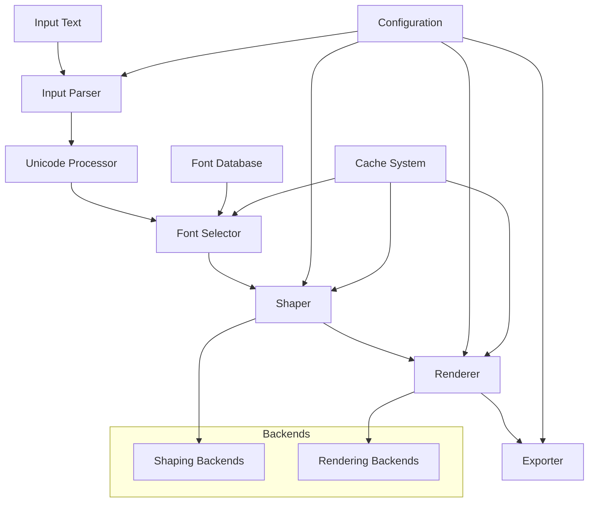

## The Six-Stage Pipeline

TYPF processes text through six distinct stages, each with clear responsibilities and interfaces:

### Stage 1: Input Parsing
**Purpose**: Convert raw input into structured text data

**Responsibilities**:
- Parse text strings and metadata
- Handle encodings and normalization
- Extract rendering parameters
- Validate input format

**Key Components**:
- [`InputParser`](17-rust-api.md#input-parser)
- [`TextBuffer`](17-rust-api.md#text-buffer)
- [`ParseOptions`](17-rust-api.md#parse-options)

### Stage 2: Unicode Processing
**Purpose**: Prepare text for complex script shaping

**Responsibilities**:
- Script detection and classification
- Bidirectional text analysis
- Text segmentation and boundaries
- Unicode normalization

**Key Components**:
- [`UnicodeProcessor`](17-rust-api.md#unicode-processor)
- [`ScriptDetector`](17-rust-api.md#script-detector)
- [`BidiAnalyzer`](17-rust-api.md#bidi-analyzer)

### Stage 3: Font Selection
**Purpose**: Choose optimal fonts for the text content

**Responsibilities**:
- Font matching and fallback
- Script-specific font selection
- Style and weight matching
- Font loading and caching

**Key Components**:
- [`FontSelector`](17-rust-api.md#font-selector)
- [`FontDatabase`](17-rust-api.md#font-database)
- [`FontLoader`](17-rust-api.md#font-loader)

### Stage 4: Shaping
**Purpose**: Convert characters to positioned glyphs

**Responsibilities**:
- Glyph substitution and positioning
- Complex script shaping (Arabic, Indic, etc.)
- Kerning and ligatures
- Metrics calculation

**Key Components**:
- [`Shaper`](17-rust-api.md#shaper-trait)
- [Shaping Backends](09-harfbuzz-shaping.md)
- [`GlyphBuffer`](17-rust-api.md#glyph-buffer)

### Stage 5: Rendering
**Purpose**: Convert glyphs to visual output

**Responsibilities**:
- Rasterization and vectorization
- Color and effect application
- Subpixel positioning
- Scaling and transformation

**Key Components**:
- [`Renderer`](17-rust-api.md#renderer-trait)
- [Rendering Backends](13-skia-rendering.md)
- [`RenderContext`](17-rust-api.md#render-context)

### Stage 6: Export
**Purpose**: Output rendered data in various formats

**Responsibilities**:
- Format conversion and encoding
- Metadata embedding
- Compression and optimization
- File writing and streaming

**Key Components**:
- [`Exporter`](17-rust-api.md#exporter-trait)
- [Export Formats](22-export-formats.md)
- [`ExportOptions`](17-rust-api.md#export-options)

## Backend Architecture

### Shaping Backends

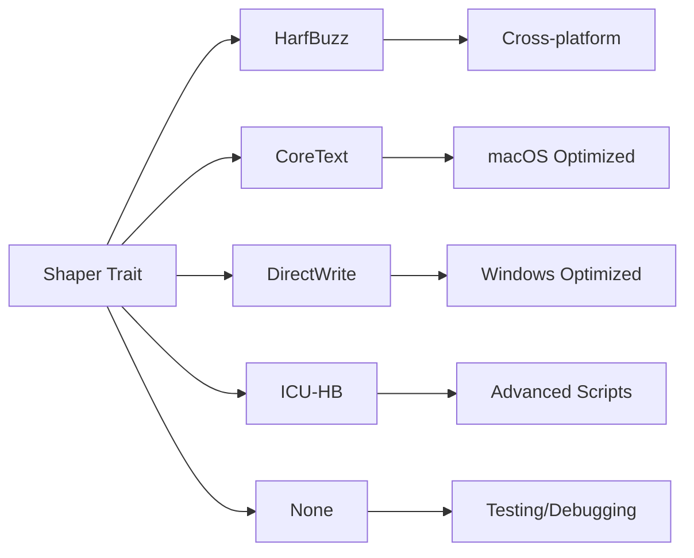

Each shaping backend implements the [`Shaper`](17-rust-api.md#shaper-trait) trait:

```rust
pub trait Shaper: Send + Sync {
    fn shape(&self, text: &str, font: &Font, options: &ShapeOptions) -> Result<ShapingResult>;
    fn supports_script(&self, script: Script) -> bool;
    fn get_features(&self) -> ShaperFeatures;
}
```

### Rendering Backends

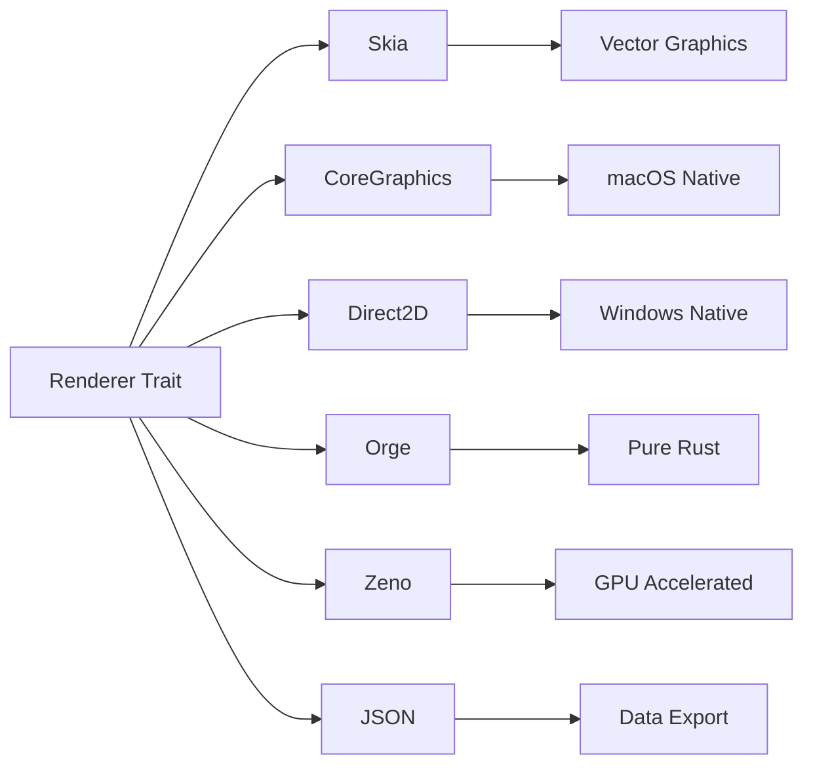

Each rendering backend implements the [`Renderer`](17-rust-api.md#renderer-trait) trait:

```rust
pub trait Renderer: Send + Sync {
    fn render(&self, glyphs: &[Glyph], context: &RenderContext) -> Result<RenderOutput>;
    fn supports_format(&self, format: PixelFormat) -> bool;
    fn get_features(&self) -> RendererFeatures;
}
```

## Component Relationships

### Core Components

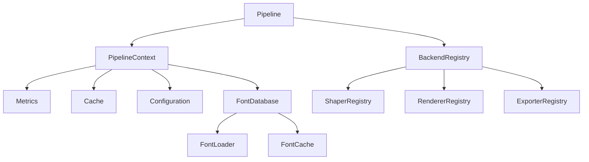

### Data Flow

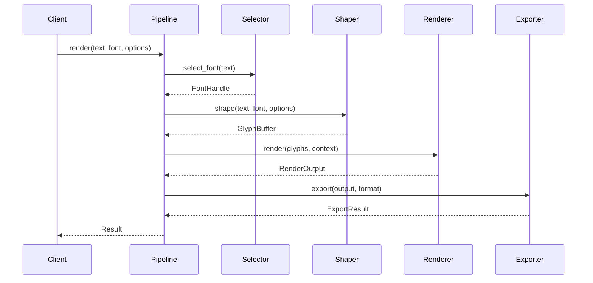

## Memory Management

### Font Handling

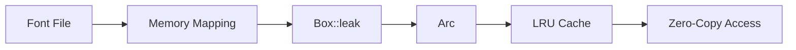

**Key Principles**:
- **Zero-Copy Loading**: Fonts are memory-mapped, not copied
- **Intentional Leaking**: `Box::leak()` for static font data
- **Shared Ownership**: `Arc<Font>` for safe sharing
- **LRU Eviction**: Automatic cache management

### Glyph Caching

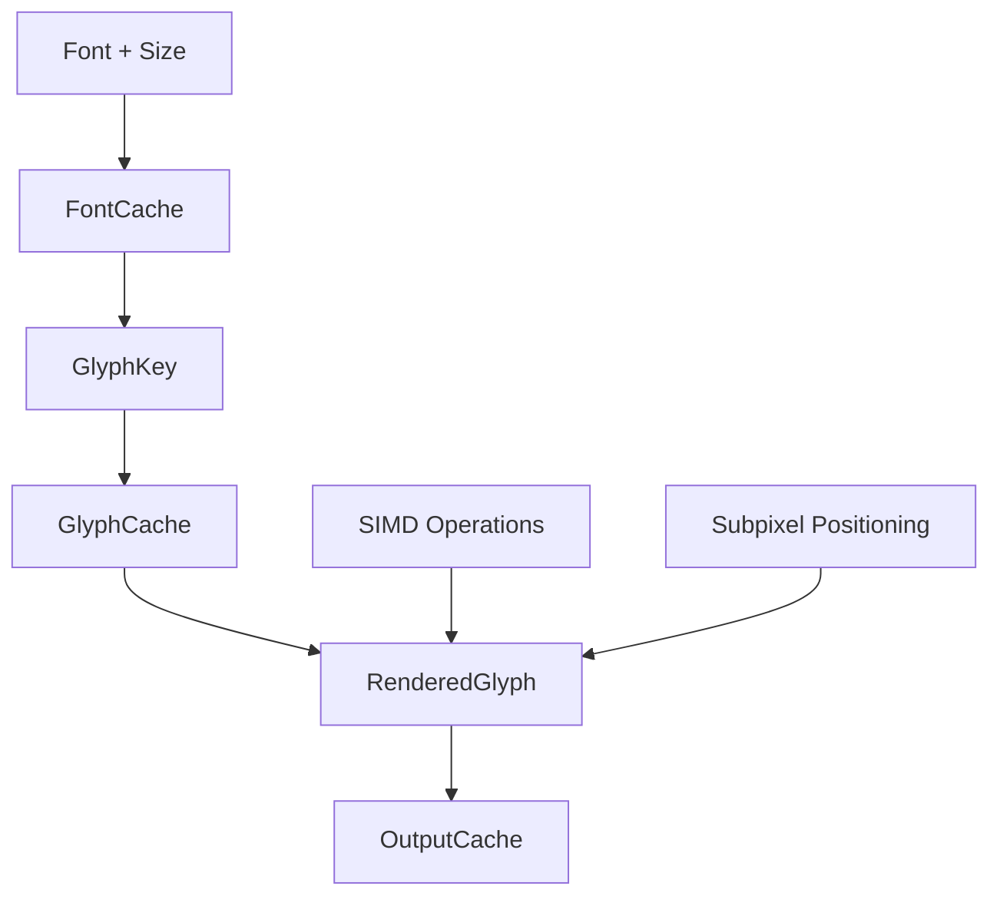

**Cache Hierarchy**:
1. **Font Cache**: Loaded font data (LRU eviction)
2. **Glyph Cache**: Rendered glyph images
3. **Output Cache**: Complete rendered frames

## Performance Architecture

### SIMD Acceleration

```rust
// Example: SIMD-optimized alpha compositing
fn composite_alpha_simd(dst: &mut [u8], src: &[u8], alpha: u8) {
    use std::arch::x86_64::*;
    
    unsafe {
        let alpha_vec = _mm_set1_epi8(alpha as i8);
        
        for (dst_chunk, src_chunk) in dst.chunks_exact_mut(16).zip(src.chunks_exact(16)) {
            let dst_vec = _mm_loadu_si128(dst_chunk.as_ptr() as *const __m128i);
            let src_vec = _mm_loadu_si128(src_chunk.as_ptr() as *const __m128i);
            
            let result = _mm_blendv_epi8(dst_vec, src_vec, alpha_vec);
            _mm_storeu_si128(dst_chunk.as_mut_ptr() as *mut __m128i, result);
        }
    }
}
```

### Concurrency Strategy

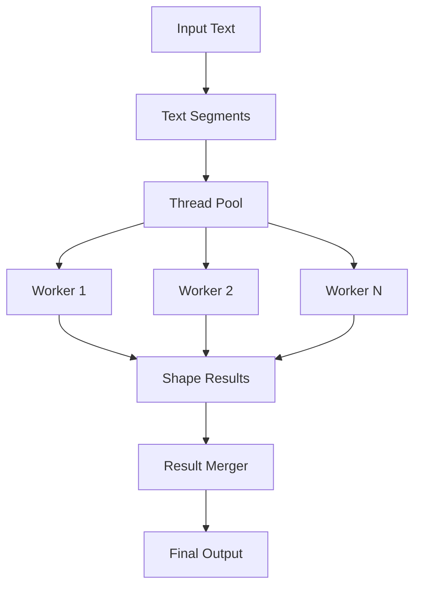

**Concurrency Patterns**:
- **Pipeline Parallelism**: Different stages can run concurrently
- **Data Parallelism**: Text segments processed in parallel
- **Cache Coherency**: Shared caches with proper synchronization
- **Lock-Free Structures**: `DashMap` for concurrent access

## Configuration Architecture

### Feature Flags

```toml
# Cargo.toml
[features]
default = ["shaping-hb", "render-skia", "export-png"]
minimal = ["shaping-none", "render-orge", "export-pnm"]
full = [
    "shaping-hb", "shaping-coretext", "shaping-directwrite",
    "render-skia", "render-coregraphics", "render-direct2d",
    "export-png", "export-svg", "export-json"
]

shaping-hb = ["harfbuzz_rs"]
shaping-coretext = ["coretext-rs"]
render-skia = ["skia-safe"]
export-png = ["image"]
```

### Runtime Configuration

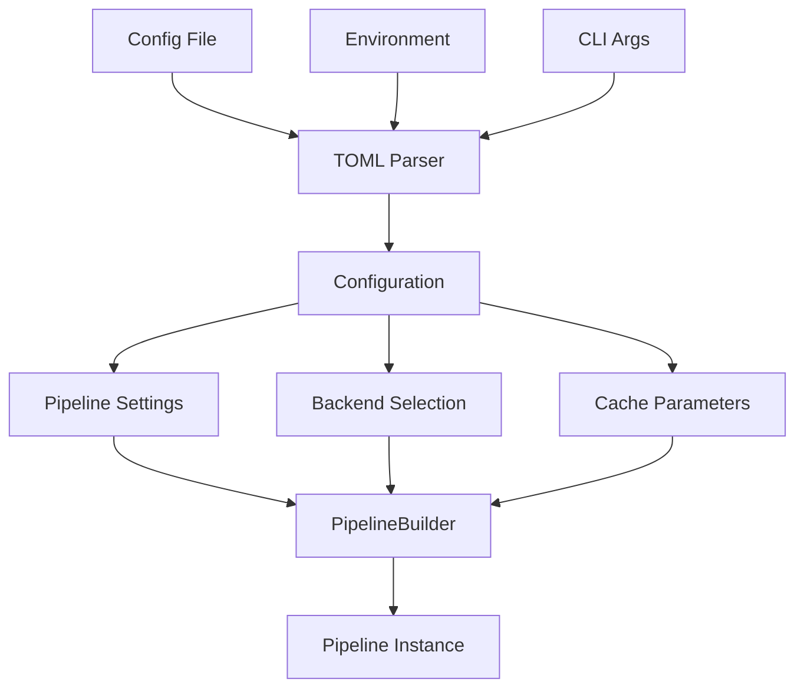

## Error Handling Architecture

### Error Types

```rust
#[derive(Debug, thiserror::Error)]
pub enum TypfError {
    #[error("Font not found: {path}")]
    FontNotFound { path: PathBuf },
    
    #[error("Shaping failed: {backend}")]
    ShapingFailed { backend: String },
    
    #[error("Rendering failed: {backend}")]
    RenderingFailed { backend: String },
    
    #[error("Feature not compiled: {feature}")]
    FeatureNotCompiled { feature: String },
    
    #[error("Memory allocation failed")]
    OutOfMemory,
}
```

### Error Propagation

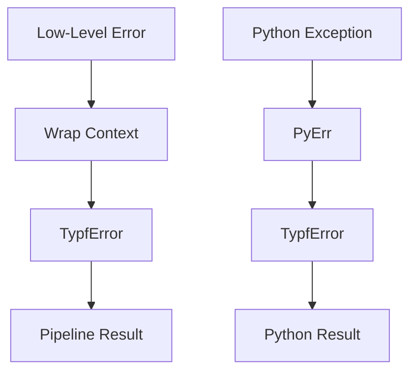

## Testing Architecture

### Test Pyramid

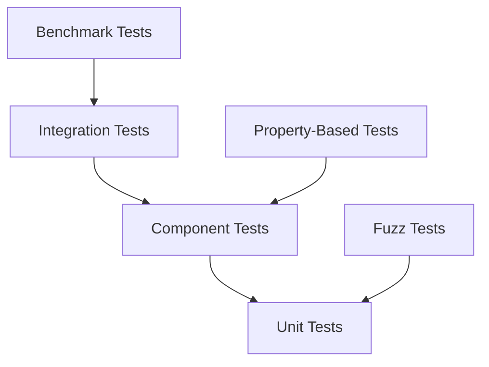

### Test Categories

1. **Unit Tests**: Individual component functionality
2. **Integration Tests**: Pipeline and backend interaction
3. **Property Tests**: Invariant preservation
4. **Fuzz Tests**: Robustness and crash resistance
5. **Benchmark Tests**: Performance regression detection

## Extensibility Architecture

### Backend Registration

```rust
pub struct BackendRegistry {
    shapers: HashMap<String, Box<dyn ShaperFactory>>,
    renderers: HashMap<String, Box<dyn RendererFactory>>,
    exporters: HashMap<String, Box<dyn ExporterFactory>>,
}

impl BackendRegistry {
    pub fn register_shaper(&mut self, name: &str, factory: Box<dyn ShaperFactory>) {
        self.shapers.insert(name.to_string(), factory);
    }
}
```

### Plugin Architecture (Future)

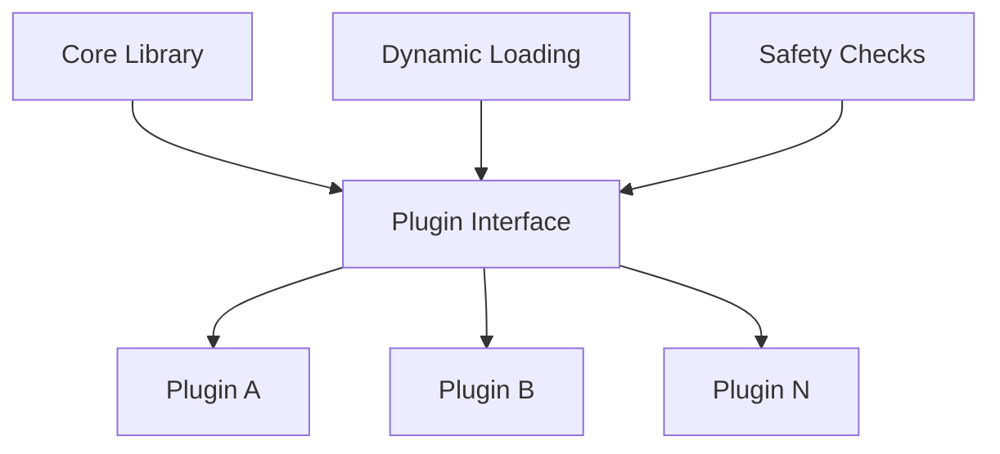

## Implementation Phases

### Phase 1: Core Foundation
- Basic pipeline structure
- Essential traits and types
- Minimal working implementation

### Phase 2: Backend Implementation
- HarfBuzz shaping backend
- Skia rendering backend
- Basic export formats

### Phase 3: Platform Integration
- CoreText and DirectWrite
- Platform-specific optimizations
- System font integration

### Phase 4: Advanced Features
- SIMD optimizations
- Advanced caching
- Variable font support

### Phase 5: Python Bindings
- PyO3 integration
- Python API design
- Package distribution

### Phase 6: Production Ready
- Comprehensive testing
- Documentation completion
- Performance optimization

## Next Steps

Now that you understand the architecture, explore:

- [The Six-Stage Pipeline](05-six-stage-pipeline.md) - Deep dive into each stage
- [Backend Architecture](06-backend-architecture.md) - Backend implementation details
- [Memory Management](07-memory-management.md) - Efficient memory usage
- [Performance Fundamentals](08-performance-fundamentals.md) - Optimization strategies

---

**TYPF's architecture** is designed for performance, modularity, and extensibility. Each component has clear responsibilities and well-defined interfaces, making the system both powerful and maintainable.
