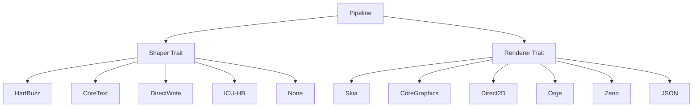

# Backend Architecture

TYPF v2.0's backend architecture provides a pluggable system for shaping and rendering, allowing optimal combinations for any use case. This chapter explores the design patterns, implementation details, and extension mechanisms of the backend system.

## Backend Design Principles

### Separation of Concerns



### Core Traits

#### The Shaper Trait

```rust
pub trait Shaper: Send + Sync + Debug {
    /// Shape text into positioned glyphs
    fn shape(&self, 
             text: &str, 
             font: &FontHandle, 
             options: &ShapeOptions) -> Result<ShapingResult>;
    
    /// Check if this shaper supports the given script
    fn supports_script(&self, script: Script) -> bool;
    
    /// Get the features this shaper supports
    fn supported_features(&self) -> ShaperFeatures;
    
    /// Get human-readable name
    fn name(&self) -> &'static str;
    
    /// Get backend version
    fn version(&self) -> &'static str;
}

pub struct ShaperFeatures {
    pub supports_ligatures: bool,
    pub supports_kerning: bool,
    pub supports_contextual: bool,
    pub supports_vertical: bool,
    pub supports_variation_fonts: bool,
    pub max_text_length: Option<usize>,
}
```

#### The Renderer Trait

```rust
pub trait Renderer: Send + Sync + Debug {
    /// Render shaped glyphs into visual output
    fn render(&self, 
              glyphs: &[Glyph], 
              context: &RenderContext) -> Result<RenderOutput>;
    
    /// Check if this renderer supports the format
    fn supports_format(&self, format: PixelFormat) -> bool;
    
    /// Get the features this renderer supports
    fn supported_features(&self) -> RendererFeatures;
    
    /// Get optimal DPI for this renderer
    fn optimal_dpi(&self) -> f32;
    
    /// Get human-readable name
    fn name(&self) -> &'static str;
}

pub struct RendererFeatures {
    pub supports_antialiasing: bool,
    pub supports_subpixel: bool,
    pub supports_lcd: bool,
    pub supports_vector: bool,
    pub supports_transforms: bool,
    pub max_texture_size: Option<u32>,
}
```

## Shaping Backends

### HarfBuzz Shaper (Cross-platform)

The most versatile shaper, supporting the widest range of scripts and features.

```rust
pub struct HarfBuzzShaper {
    hb_font: harfbuzz_rs::Font<'static>,
    features_cache: HashMap<String, Vec<harfbuzz_rs::Feature>>,
}

impl HarfBuzzShaper {
    pub fn new() -> Result<Self> {
        Ok(Self {
            hb_font: harfbuzz_rs::Font::new(),
            features_cache: HashMap::new(),
        })
    }
    
    pub fn with_font(font: &FontHandle) -> Result<Self> {
        let hb_font = harfbuzz_rs::Font::from_font_data(&font.font_data)?;
        Ok(Self {
            hb_font,
            features_cache: HashMap::new(),
        })
    }
    
    fn resolve_features_cached(&mut self, script: Script, language: Option<Language>) -> Result<Vec<harfbuzz_rs::Feature>> {
        let cache_key = format!("{:?}_{:?}", script, language);
        
        if let Some(cached) = self.features_cache.get(&cache_key) {
            return Ok(cached.clone());
        }
        
        let features = self.resolve_features(script, language)?;
        self.features_cache.insert(cache_key, features.clone());
        Ok(features)
    }
    
    fn resolve_features(&self, script: Script, language: Option<Language>) -> Result<Vec<harfbuzz_rs::Feature>> {
        let mut features = Vec::new();
        
        // Common features
        features.push(harfbuzz_rs::Feature::new('kern', 1, harfbuzz_rs::FeatureFlags::Global));
        features.push(harfbuzz_rs::Feature::new('liga', 1, harfbuzz_rs::FeatureFlags::Global));
        
        // Script-specific features
        match script {
            Script::Arabic => {
                features.extend_from_slice(&[
                    harfbuzz_rs::Feature::new('rlig', 1, harfbuzz_rs::FeatureFlags::Global),
                    harfbuzz_rs::Feature::new('calt', 1, harfbuzz_rs::FeatureFlags::Global),
                    harfbuzz_rs::Feature::new('isol', 1, harfbuzz_rs::FeatureFlags::Global),
                    harfbuzz_rs::Feature::new('fina', 1, harfbuzz_rs::FeatureFlags::Global),
                    harfbuzz_rs::Feature::new('medi', 1, harfbuzz_rs::FeatureFlags::Global),
                    harfbuzz_rs::Feature::new('init', 1, harfbuzz_rs::FeatureFlags::Global),
                ]);
            },
            Script::Devanagari => {
                features.extend_from_slice(&[
                    harfbuzz_rs::Feature::new('locl', 1, harfbuzz_rs::FeatureFlags::Global),
                    harfbuzz_rs::Feature::new('blwf', 0, harfbuzz_rs::FeatureFlags::Global),
                    harfbuzz_rs::Feature::new('half', 1, harfbuzz_rs::FeatureFlags::Global),
                    harfbuzz_rs::Feature::new('akhn', 1, harfbuzz_rs::FeatureFlags::Global),
                ]);
            },
            _ => {}
        }
        
        Ok(features)
    }
}

impl Shaper for HarfBuzzShaper {
    fn shape(&self, text: &str, font: &FontHandle, options: &ShapeOptions) -> Result<ShapingResult> {
        let mut buffer = harfbuzz_rs::UnicodeBuffer::new();
        
        // Set text properties
        buffer.set_direction(options.direction.into());
        buffer.set_script(options.script.into());
        buffer.set_language(options.language.map(|l| l.into()).unwrap_or(harfbuzz_rs::Language::from_str("en")));
        
        // Add text
        buffer.add_str(text);
        
        // Set features
        let features = self.resolve_features(options.script, options.language)?;
        
        // Create HarfBuzz font
        let hb_font = harfbuzz_rs::Font::from_font_data(&font.font_data)?;
        
        // Shape
        let output = harfbuzz_rs::shape(&hb_font, buffer, &features);
        
        // Convert to our format
        self.convert_harfbuzz_output(output, font)
    }
    
    fn supports_script(&self, script: Script) -> bool {
        // HarfBuzz supports virtually all scripts
        matches!(script, 
            Script::Latin | Script::Arabic | Script::Devanagari | Script::Hebrew |
            Script::Thai | Script::Bengali | Script::Gurmukhi | Script::Gujarati |
            Script::Oriya | Script::Tamil | Script::Telugu | Script::Kannada |
            Script::Malayalam | Script::Sinhala | Script::Myanmar | Script::Khmer |
            Script::Lao | Script::Tibetan | Script::Georgian | Script::Armenian |
            Script::Ethiopic | Script::Cherokee | Script::Canadian_Aboriginal |
            Script::Ogham | Script::Runic | Script::Mongolian | Script::Hiragana |
            Script::Katakana | Script::Hangul | Script::Han | Script::Bopomofo |
            Script::Yi | Script::Old_Italic | Script::Gothic | Script::Deseret |
            Script::Byzantine_Musical | Script::Musical | Script::Mathematical |
            Script::Braille | Script::Common | Script::Inherited
        )
    }
    
    fn supported_features(&self) -> ShaperFeatures {
        ShaperFeatures {
            supports_ligatures: true,
            supports_kerning: true,
            supports_contextual: true,
            supports_vertical: true,
            supports_variation_fonts: true,
            max_text_length: Some(1_000_000), // Practical limit
        }
    }
    
    fn name(&self) -> &'static str {
        "HarfBuzz"
    }
    
    fn version(&self) -> &'static str {
        harfbuzz_sys::hb_version_string()
    }
}
```

### CoreText Shaper (macOS)

Native macOS shaper with excellent performance and system font integration.

```rust
#[cfg(target_os = "macos")]
pub struct CoreTextShaper {
    frame_typesetter: core_text::CTFrameSetter,
    cache: LruCache<String, ShapingResult>,
}

#[cfg(target_os = "macos")]
impl CoreTextShaper {
    pub fn new() -> Result<Self> {
        Ok(Self {
            frame_typesetter: core_text::CTFrameSetter::new()?,
            cache: LruCache::new(1000),
        })
    }
    
    fn create_attributed_string(&self, text: &str, font: &FontHandle, options: &ShapeOptions) -> Result<core_text::CTAttributedString> {
        let mut attributes = core_text::CTAttributes::new();
        
        // Set font
        attributes.set_font(&font.coretext_font);
        
        // Set direction
        match options.direction {
            Direction::LeftToRight => {
                attributes.set_writing_direction(core_text::WritingDirection::LeftToRight);
            },
            Direction::RightToLeft => {
                attributes.set_writing_direction(core_text::WritingDirection::RightToLeft);
            },
        }
        
        // Create attributed string
        core_text::CTAttributedString::new(text, attributes)
    }
}

#[cfg(target_os = "macos")]
impl Shaper for CoreTextShaper {
    fn shape(&self, text: &str, font: &FontHandle, options: &ShapeOptions) -> Result<ShapingResult> {
        let cache_key = format!("{}_{:?}_{:?}", text, font.id, options);
        
        if let Some(cached) = self.cache.get(&cache_key) {
            return Ok(cached.clone());
        }
        
        let attributed_string = self.create_attributed_string(text, font, options)?;
        let frame = self.frame_typesetter.create_frame(&attributed_string)?;
        let lines = frame.get_lines();
        
        let mut glyphs = Vec::new();
        let mut positions = Vec::new();
        
        for line in lines {
            let line_glyphs = line.get_glyph_runs();
            for run in line_glyphs {
                glyphs.extend(run.glyphs);
                positions.extend(run.positions);
            }
        }
        
        let result = ShapingResult {
            glyphs,
            advances: self.calculate_advances(&glyphs, &positions)?,
            positions,
            clusters: self.generate_clusters(text, &glyphs)?,
            direction: options.direction,
            script: options.script,
        };
        
        self.cache.put(cache_key, result.clone());
        Ok(result)
    }
    
    fn supports_script(&self, script: Script) -> bool {
        // CoreText supports virtually all scripts on macOS
        !matches!(script, Script::Unknown)
    }
    
    fn supported_features(&self) -> ShaperFeatures {
        ShaperFeatures {
            supports_ligatures: true,
            supports_kerning: true,
            supports_contextual: true,
            supports_vertical: true, // For CJK vertical text
            supports_variation_fonts: true, // macOS 10.13+
            max_text_length: Some(10_000_000),
        }
    }
    
    fn name(&self) -> &'static str {
        "CoreText"
    }
    
    fn version(&self) -> &'static str {
        "System CoreText Framework"
    }
}
```

### DirectWrite Shaper (Windows)

Windows native shaper with excellent performance and system integration.

```rust
#[cfg(target_os = "windows")]
pub struct DirectWriteShaper {
    factory: directwrite::Factory,
    cache: LruCache<String, ShapingResult>,
}

#[cfg(target_os = "windows")]
impl DirectWriteShaper {
    pub fn new() -> Result<Self> {
        let factory = directwrite::Factory::new()?;
        Ok(Self {
            factory,
            cache: LruCache::new(1000),
        })
    }
    
    fn create_text_layout(&self, text: &str, font: &FontHandle, options: &ShapeOptions) -> Result<directwrite::TextLayout> {
        let mut text_format = self.factory.create_text_format(
            &font.family,
            font.size,
            font.weight.into(),
            font.style.into(),
            font.stretch.into(),
        )?;
        
        // Set reading direction
        match options.direction {
            Direction::RightToLeft => {
                text_format.set_reading_direction(directwrite::ReadingDirection::RightToLeft);
            },
            _ => {}
        }
        
        // Create text layout
        self.factory.create_text_layout(
            text,
            &text_format,
            options.max_width.unwrap_or(f32::INFINITY),
            options.max_height.unwrap_or(f32::INFINITY),
        )
    }
}

#[cfg(target_os = "windows")]
impl Shaper for DirectWriteShaper {
    fn shape(&self, text: &str, font: &FontHandle, options: &ShapeOptions) -> Result<ShapingResult> {
        let cache_key = format!("{}_{:?}_{:?}", text, font.id, options);
        
        if let Some(cached) = self.cache.get(&cache_key) {
            return Ok(cached.clone());
        }
        
        let text_layout = self.create_text_layout(text, font, options)?;
        let glyph_runs = text_layout.get_glyph_runs()?;
        
        let mut all_glyphs = Vec::new();
        let mut all_positions = Vec::new();
        
        for run in glyph_runs {
            all_glyphs.extend(run.glyphs);
            all_positions.extend(run.positions);
        }
        
        let result = ShapingResult {
            glyphs: all_glyphs,
            advances: self.calculate_advances(&glyph_runs)?,
            positions: all_positions,
            clusters: self.generate_clusters(text, &glyph_runs)?,
            direction: options.direction,
            script: options.script,
        };
        
        self.cache.put(cache_key, result.clone());
        Ok(result)
    }
    
    fn supports_script(&self, script: Script) -> bool {
        // DirectWrite supports complex scripts on Windows 8+
        cfg!(target_os = "windows") && !matches!(script, Script::Unknown)
    }
    
    fn supported_features(&self) -> ShaperFeatures {
        ShaperFeatures {
            supports_ligatures: true,
            supports_kerning: true,
            supports_contextual: true,
            supports_vertical: false, // Limited support
            supports_variation_fonts: true, // Windows 10+
            max_text_length: Some(5_000_000),
        }
    }
    
    fn name(&self) -> &'static str {
        "DirectWrite"
    }
    
    fn version(&self) -> &'static str {
        "System DirectWrite Framework"
    }
}
```

### ICU-HarfBuzz Shaper

Advanced shaper combining ICU's text analysis with HarfBuzz's shaping capabilities.

```rust
pub struct IcuHarfBuzzShaper {
    icu_processor: IcuProcessor,
    harfbuzz: HarfBuzzShaper,
    locale_cache: HashMap<String, icu_locid::Locale>,
}

impl IcuHarfBuzzShaper {
    pub fn new() -> Result<Self> {
        Ok(Self {
            icu_processor: IcuProcessor::new()?,
            harfbuzz: HarfBuzzShaper::new()?,
            locale_cache: HashMap::new(),
        })
    }
    
    fn apply_icu_analysis(&self, text: &str, language: Option<Language>) -> Result<AnalyzedText> {
        let locale = self.get_locale(language)?;
        let script_detector = icu_properties::Script::new();
        let bidi_analyzer = icu::segmenter::SentenceSegmenter::new();
        
        let mut segments = Vec::new();
        
        // Analyze text segments
        let sentence_ranges = bidi_analyzer.segment_str(text);
        for range in sentence_ranges {
            let segment_text = &text[range];
            let script = self.detect_script(segment_text, &script_detector)?;
            
            segments.push(TextSegment {
                range,
                script,
                language: language,
            });
        }
        
        Ok(AnalyzedText { segments })
    }
    
    fn detect_script(&self, text: &str, script_detector: &icu_properties::Script) -> Result<Script> {
        let mut script_counts = HashMap::new();
        
        for ch in text.chars() {
            let script = script_detector.get_script(ch)?;
            *script_counts.entry(script).or_insert(0) += 1;
        }
        
        // Find most common script
        let most_common = script_counts.iter()
            .max_by_key(|(_, count)| *count)
            .map(|(script, _)| *script)
            .unwrap_or(icu_properties::Script::Common);
        
        Ok(self.icu_script_to_typf(most_common))
    }
}
impl Shaper for IcuHarfBuzzShaper {
    fn shape(&self, text: &str, font: &FontHandle, options: &ShapeOptions) -> Result<ShapingResult> {
        // 1. Apply ICU analysis
        let analyzed = self.apply_icu_analysis(text, options.language)?;
        
        // 2. Shape each segment with HarfBuzz
        let mut all_glyphs = Vec::new();
        let mut all_advances = Vec::new();
        let mut all_positions = Vec::new();
        let mut all_clusters = Vec::new();
        
        for segment in analyzed.segments {
            let segment_text = &text[segment.range];
            let mut segment_options = options.clone();
            segment_options.script = segment.script;
            
            let result = self.harfbuzz.shape(segment_text, font, &segment_options)?;
            
            all_glyphs.extend(result.glyphs);
            all_advances.extend(result.advances);
            all_positions.extend(result.positions);
            all_clusters.extend(result.clusters);
        }
        
        Ok(ShapingResult {
            glyphs: all_glyphs,
            advances: all_advances,
            positions: all_positions,
            clusters: all_clusters,
            direction: options.direction,
            script: options.script,
        })
    }
    
    fn supports_script(&self, script: Script) -> bool {
        // ICU + HarfBuzz combination supports all scripts
        self.harfbuzz.supports_script(script)
    }
    
    fn supported_features(&self) -> ShaperFeatures {
        ShaperFeatures {
            supports_ligatures: true,
            supports_kerning: true,
            supports_contextual: true,
            supports_vertical: true,
            supports_variation_fonts: true,
            max_text_length: Some(1_000_000),
        }
    }
    
    fn name(&self) -> &'static str {
        "ICU-HarfBuzz"
    }
    
    fn version(&self) -> &'static str {
        "ICU 72+ HarfBuzz"
    }
}
```

### None Shaper (Testing)

Pass-through shaper that performs no shaping - useful for testing and simple Latin text.

```rust
pub struct NoneShaper;

impl NoneShaper {
    pub fn new() -> Self {
        Self
    }
    
    fn simple_glyph_mapping(&self, text: &str, font: &FontHandle) -> Result<Vec<Glyph>> {
        let mut glyphs = Vec::new();
        
        for (char_index, ch) in text.char_indices() {
            if let Some(glyph_id) = font.font.charcode_to_glyph(ch as u32)? {
                let metrics = font.font.get_glyph_metrics(glyph_id)?;
                
                glyphs.push(Glyph {
                    id: glyph_id,
                    codepoint: ch,
                    font: font.clone(),
                    x_advance: metrics.advance_width,
                    y_advance: metrics.advance_height,
                    x_offset: 0.0,
                    y_offset: 0.0,
                    cluster: char_index,
                });
            } else {
                return Err(Error::GlyphNotFound(ch));
            }
        }
        
        Ok(glyphs)
    }
}

impl Shaper for NoneShaper {
    fn shape(&self, text: &str, font: &FontHandle, _options: &ShapeOptions) -> Result<ShapingResult> {
        let glyphs = self.simple_glyph_mapping(text, font)?;
        let advances = glyphs.iter().map(|g| g.x_advance).collect();
        let positions = glyphs.iter()
            .enumerate()
            .map(|(i, _glyph)| Position { x: i as f32, y: 0.0 })
            .collect();
        let clusters = (0..glyphs.len()).collect();
        
        Ok(ShapingResult {
            glyphs,
            advances,
            positions,
            clusters,
            direction: Direction::LeftToRight,
            script: Script::Latin,
        })
    }
    
    fn supports_script(&self, script: Script) -> bool {
        // Only supports basic Latin scripts well
        matches!(script, Script::Latin | Script::Common)
    }
    
    fn supported_features(&self) -> ShaperFeatures {
        ShaperFeatures {
            supports_ligatures: false,
            supports_kerning: false,
            supports_contextual: false,
            supports_vertical: false,
            supports_variation_fonts: false,
            max_text_length: None,
        }
    }
    
    fn name(&self) -> &'static str {
        "None"
    }
    
    fn version(&self) -> &'static str {
        "1.0.0"
    }
}
```

## Rendering Backends

### Skia Renderer (Cross-platform)

High-performance vector graphics renderer with excellent feature support.

```rust
pub struct SkiaRenderer {
    surface: skia_safe::Surface,
    canvas: skia_safe::Canvas,
    paint: skia_safe::Paint,
}

impl SkiaRenderer {
    pub fn new(size: (u32, u32), format: PixelFormat) -> Result<Self> {
        let info = skia_safe::ImageInfo::new(
            skia_safe::ISize::new(size.0 as i32, size.1 as i32),
            format.into(),
            skia_safe::AlphaType::Premul,
            None,
        );
        
        let mut surface = skia_safe::Surface::new_raster_n32_premul(
            &info,
            None,
            size.0 as usize * format.bytes_per_pixel(),
        ).ok_or(Error::SurfaceCreationFailed)?;
        
        let canvas = surface.canvas();
        let mut paint = skia_safe::Paint::default();
        paint.set_antialias(true);
        paint.set_subpixel_text(true);
        
        Ok(Self {
            surface,
            canvas,
            paint,
        })
    }
    
    fn render_glyph_skia(&mut self, glyph: &Glyph, x: f32, y: f32) -> Result<()> {
        self.canvas.save();
        
        // Apply transforms
        self.canvas.translate((x, y));
        
        // Create text blob from glyph
        let text_blob = self.create_text_blob(glyph)?;
        
        // Draw
        self.canvas.draw_text_blob(&text_blob, (0.0, 0.0), &self.paint);
        
        self.canvas.restore();
        Ok(())
    }
    
    fn create_text_blob(&self, glyph: &Glyph) -> Result<skia_safe::TextBlob> {
        let mut builder = skia_safe::TextBlobBuilder::new();
        
        let run_buffer = builder.alloc_run_pos_h(
            &glyph.font.skia_font,
            &[glyph.id],
            &[glyph.x_offset],
        );
        
        run_buffer.glyphs[0] = glyph.id;
        run_buffer.positions[0] = glyph.x_offset;
        
        Ok(builder.make())
    }
}

impl Renderer for SkiaRenderer {
    fn render(&self, glyphs: &[Glyph], context: &RenderContext) -> Result<RenderOutput> {
        let mut renderer = Self::new(context.size, context.format)?;
        
        // Clear background
        renderer.canvas.clear(context.background_color.to_skia());
        
        // Set up paint
        renderer.paint.set_color(context.color.to_skia());
        renderer.paint.set_blend_mode(context.blend_mode.to_skia());
        
        // Render each glyph
        let mut current_x = 0.0;
        for glyph in glyphs {
            renderer.render_glyph_skia(glyph, current_x, context.baseline)?;
            current_x += glyph.x_advance;
        }
        
        // Extract image data
        let image = renderer.surface.make_image_snapshot();
        let data = image.encode_to_data(skia_safe::EncodedImageFormat::PNG)
            .ok_or(Error::ImageEncodingFailed)?;
        
        Ok(RenderOutput {
            data: RenderData::Bitmap(data.as_bytes().to_vec()),
            width: context.size.width,
            height: context.size.height,
            format: context.format,
            dpi: context.dpi,
            transform: context.transform,
        })
    }
    
    fn supports_format(&self, format: PixelFormat) -> bool {
        matches!(format, 
            PixelFormat::RGBA8888 | PixelFormat::BGRA8888 | 
            PixelFormat::RGB888 | PixelFormat::Gray8
        )
    }
    
    fn supported_features(&self) -> RendererFeatures {
        RendererFeatures {
            supports_antialiasing: true,
            supports_subpixel: true,
            supports_lcd: true,
            supports_vector: true,
            supports_transforms: true,
            max_texture_size: Some(16384),
        }
    }
    
    fn name(&self) -> &'static str {
        "Skia"
    }
    
    fn optimal_dpi(&self) -> f32 {
        96.0
    }
}
```

### Orge Renderer (Pure Rust)

Lightweight pure Rust rasterizer for minimal builds.

```rust
pub struct OrgeRenderer {
    bitmap: Vec<u8>,
    width: u32,
    height: u32,
    format: PixelFormat,
}

impl OrgeRenderer {
    pub fn new(size: (u32, u32), format: PixelFormat) -> Result<Self> {
        let bitmap_len = (size.0 * size.1) as usize * format.bytes_per_pixel();
        Ok(Self {
            bitmap: vec![0; bitmap_len],
            width: size.0,
            height: size.1,
            format,
        })
    }
    
    fn rasterize_glyph_orge(&mut self, glyph: &Glyph, x: u32, y: u32) -> Result<()> {
        // Use Orge reference implementation
        let rasterizer = orge::Rasterizer::new();
        
        // Rasterize glyph
        let glyph_bitmap = rasterizer.rasterize_glyph(
            glyph.id,
            glyph.font.orge_data,
            glyph.font.size,
        )?;
        
        // Composite into main bitmap
        self.composite_glyph(&glyph_bitmap, x, y)?;
        
        Ok(())
    }
    
    fn composite_glyph(&mut self, glyph_bitmap: &orge::Bitmap, x: u32, y: u32) -> Result<()> {
        let bytes_per_pixel = self.format.bytes_per_pixel();
        
        for row in 0..glyph_bitmap.height.min(self.height - y) {
            for col in 0..glyph_bitmap.width.min(self.width - x) {
                let glyph_idx = (row * glyph_bitmap.width + col) as usize;
                let output_idx = ((y + row) * self.width + (x + col)) as usize * bytes_per_pixel;
                
                if glyph_idx >= glyph_bitmap.data.len() || output_idx + bytes_per_pixel > self.bitmap.len() {
                    continue;
                }
                
                let alpha = glyph_bitmap.data[glyph_idx];
                
                match self.format {
                    PixelFormat::RGBA8888 => {
                        self.bitmap[output_idx + 0] = 255;     // R
                        self.bitmap[output_idx + 1] = 255;     // G
                        self.bitmap[output_idx + 2] = 255;     // B
                        self.bitmap[output_idx + 3] = alpha;   // A
                    },
                    PixelFormat::Gray8 => {
                        self.bitmap[output_idx] = alpha;
                    },
                    _ => return Err(Error::UnsupportedPixelFormat(self.format)),
                }
            }
        }
        
        Ok(())
    }
}

impl Renderer for OrgeRenderer {
    fn render(&self, glyphs: &[Glyph], context: &RenderContext) -> Result<RenderOutput> {
        let mut renderer = Self::new(context.size, context.format)?;
        
        // Render each glyph
        let mut current_x = 0u32;
        for glyph in glyphs {
            let glyph_x = current_x + glyph.x_offset as u32;
            let glyph_y = context.baseline as u32 + glyph.y_offset as u32;
            
            renderer.rasterize_glyph_orge(glyph, glyph_x, glyph_y)?;
            current_x += glyph.x_advance as u32;
        }
        
        Ok(RenderOutput {
            data: RenderData::Bitmap(renderer.bitmap),
            width: renderer.width,
            height: renderer.height,
            format: renderer.format,
            dpi: context.dpi,
            transform: context.transform,
        })
    }
    
    fn supports_format(&self, format: PixelFormat) -> bool {
        matches!(format, PixelFormat::RGBA8888 | PixelFormat::Gray8)
    }
    
    fn supported_features(&self) -> RendererFeatures {
        RendererFeatures {
            supports_antialiasing: true,
            supports_subpixel: false,
            supports_lcd: false,
            supports_vector: false,
            supports_transforms: false,
            max_texture_size: Some(4096),
        }
    }
    
    fn name(&self) -> &'static str {
        "Orge"
    }
    
    fn optimal_dpi(&self) -> f32 {
        72.0
    }
}
```

## Backend Registry

### Registration System

```rust
pub struct BackendRegistry {
    shapers: HashMap<String, Box<dyn ShaperFactory>>,
    renderers: HashMap<String, Box<dyn RendererFactory>>,
}

impl BackendRegistry {
    pub fn new() -> Self {
        let mut registry = Self {
            shapers: HashMap::new(),
            renderers: HashMap::new(),
        };
        
        // Register built-in backends
        registry.register_builtin_backends();
        registry
    }
    
    fn register_builtin_backends(&mut self) {
        // Shaping backends
        #[cfg(feature = "shaping-hb")]
        self.register_shaper("harfbuzz", Box::new(HarfBuzzFactory));
        
        #[cfg(feature = "shaping-coretext")]
        self.register_shaper("coretext", Box::new(CoreTextFactory));
        
        #[cfg(feature = "shaping-directwrite")]
        self.register_shaper("directwrite", Box::new(DirectWriteFactory));
        
        #[cfg(feature = "shaping-icu-hb")]
        self.register_shaper("icu-hb", Box::new(IcuHarfBuzzFactory));
        
        #[cfg(feature = "shaping-none")]
        self.register_shaper("none", Box::new(NoneFactory));
        
        // Rendering backends
        #[cfg(feature = "render-skia")]
        self.register_renderer("skia", Box::new(SkiaFactory));
        
        #[cfg(feature = "render-coregraphics")]
        self.register_renderer("coregraphics", Box::new(CoreGraphicsFactory));
        
        #[cfg(feature = "render-direct2d")]
        self.register_renderer("direct2d", Box::new(Direct2DFactory));
        
        #[cfg(feature = "render-orge")]
        self.register_renderer("orge", Box::new(OrgeFactory));
        
        #[cfg(feature = "render-zeno")]
        self.register_renderer("zeno", Box::new(ZenoFactory));
        
        #[cfg(feature = "render-json")]
        self.register_renderer("json", Box::new(JsonFactory));
    }
    
    pub fn register_shaper(&mut self, name: &str, factory: Box<dyn ShaperFactory>) {
        self.shapers.insert(name.to_string(), factory);
    }
    
    pub fn register_renderer(&mut self, name: &str, factory: Box<dyn RendererFactory>) {
        self.renderers.insert(name.to_string(), factory);
    }
    
    pub fn create_shaper(&self, name: &str) -> Result<Box<dyn Shaper>> {
        self.shapers.get(name)
            .ok_or_else(|| Error::BackendNotFound(name.to_string()))
            .and_then(|factory| factory.create())
    }
    
    pub fn create_renderer(&self, name: &str) -> Result<Box<dyn Renderer>> {
        self.renderers.get(name)
            .ok_or_else(|| Error::BackendNotFound(name.to_string()))
            .and_then(|factory| factory.create())
    }
    
    pub fn list_shapers(&self) -> Vec<&str> {
        self.shapers.keys().map(|s| s.as_str()).collect()
    }
    
    pub fn list_renderers(&self) -> Vec<&str> {
        self.renderers.keys().map(|s| s.as_str()).collect()
    }
}
```

### Factory Traits

```rust
pub trait ShaperFactory: Send + Sync {
    fn create(&self) -> Result<Box<dyn Shaper>>;
    fn name(&self) -> &'static str;
    fn features(&self) -> ShaperFeatures;
}

pub trait RendererFactory: Send + Sync {
    fn create(&self) -> Result<Box<dyn Renderer>>;
    fn name(&self) -> &'static str;
    fn features(&self) -> RendererFeatures;
}
```

## Backend Selection

### Automatic Selection

```rust
pub struct BackendSelector {
    registry: BackendRegistry,
    metrics: BackendMetrics,
}

impl BackendSelector {
    pub fn select_optimal(&self, script: Script, format: PixelFormat, performance_weight: f32) -> Result<(String, String)> {
        let available_shapers = self.get_available_shapers(script);
        let available_renderers = self.get_available_renderers(format);
        
        let shaper = self.select_shaper(&available_shapers, performance_weight)?;
        let renderer = self.select_renderer(&available_renderers, performance_weight)?;
        
        Ok((shaper, renderer))
    }
    
    fn select_shaper(&self, candidates: &[&str], performance_weight: f32) -> Result<String> {
        let mut best_candidate = candidates.first().ok_or(Error::NoAvailableBackends)?;
        let mut best_score = self.calculate_backend_score(*best_candidate, performance_weight);
        
        for &candidate in candidates.iter().skip(1) {
            let score = self.calculate_backend_score(candidate, performance_weight);
            if score > best_score {
                best_score = score;
                best_candidate = candidate;
            }
        }
        
        Ok(best_candidate.to_string())
    }
    
    fn calculate_backend_score(&self, backend: &str, performance_weight: f32) -> f32 {
        let metrics = self.metrics.get_backend_metrics(backend);
        let performance_score = metrics.performance_score;
        let compatibility_score = metrics.compatibility_score;
        
        performance_weight * performance_score + (1.0 - performance_weight) * compatibility_score
    }
}
```

### Platform-Specific Optimization

```rust
impl BackendSelector {
    pub fn select_platform_optimal(&self) -> Result<(String, String)> {
        #[cfg(target_os = "macos")]
        {
            if self.registry.list_shapers().contains(&"coretext") && 
               self.registry.list_renderers().contains(&"coregraphics") {
                return Ok(("coretext".to_string(), "coregraphics".to_string()));
            }
        }
        
        #[cfg(target_os = "windows")]
        {
            if self.registry.list_shapers().contains(&"directwrite") && 
               self.registry.list_renderers().contains(&"direct2d") {
                return Ok(("directwrite".to_string(), "direct2d".to_string()));
            }
        }
        
        // Fall back to cross-platform options
        if self.registry.list_shapers().contains(&"harfbuzz") && 
           self.registry.list_renderers().contains(&"skia") {
            return Ok(("harfbuzz".to_string(), "skia".to_string()));
        }
        
        // Finally, minimal option
        Ok(("none".to_string(), "orge".to_string()))
    }
}
```

## Next Steps

Now that you understand the backend architecture:

- [Memory Management](07-memory-management.md) - Efficient memory usage strategies
- [Performance Fundamentals](08-performance-fundamentals.md) - Core optimization principles
- [HarfBuzz Shaping](09-harfbuzz-shaping.md) - Deep dive into the main shaping backend
- [Skia Rendering](13-skia-rendering.md) - Explore the primary rendering backend

---

**The backend architecture** provides a flexible, extensible system that allows TYPF to adapt to any platform or use case while maintaining excellent performance across all configurations.
