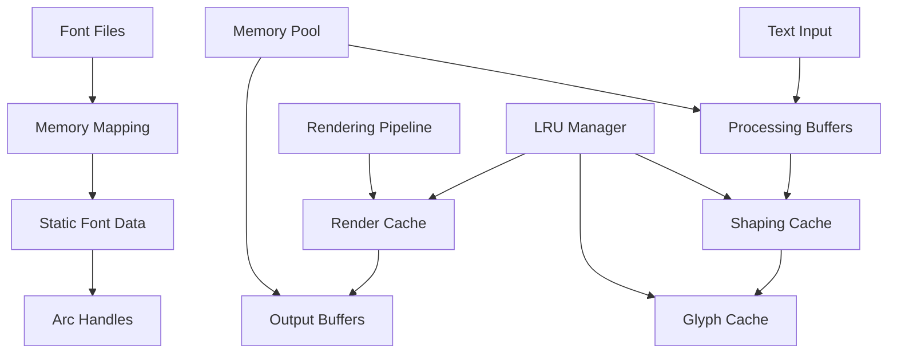

# Memory Management

TYPF v2.0 employs sophisticated memory management strategies to achieve high performance while maintaining efficient resource usage. This chapter explores the caching systems, font loading strategies, and memory optimization techniques that make TYPF both fast and memory-efficient.

## Memory Architecture Overview



## Font Memory Management

### Zero-Copy Font Loading

TYPF uses memory mapping and intentional leaking for efficient font data management:

```rust
pub struct FontLoader {
    cache: Arc<RwLock<LruCache<FontKey, Arc<Font>>>>,
    memory_stats: Arc<Mutex<MemoryStats>>,
}

impl FontLoader {
    pub fn load_font(&self, path: &Path) -> Result<Arc<Font>> {
        let key = FontKey::from_path(path);
        
        // Check cache first
        if let Some(font) = self.cache.read().unwrap().get(&key) {
            return Ok(font.clone());
        }
        
        // Load font with memory mapping
        let font = self.load_font_memory_mapped(path)?;
        
        // Cache the loaded font
        self.cache.write().unwrap().put(key, font.clone());
        
        Ok(font)
    }
    
    fn load_font_memory_mapped(&self, path: &Path) -> Result<Arc<Font>> {
        // 1. Memory map the font file
        let file = std::fs::File::open(path)?;
        let mmap = unsafe { memmap2::Mmap::map(&file)? };
        
        // 2. Parse fonts using read-fonts crate
        let font_collection = read_fonts::FontCollection::from_bytes(&*mmap)?;
        let font_data = font_collection.into_single()?; // Or handle collections
        
        // 3. Intentionally leak the memory mapped data
        let leaked_data: &'static [u8] = Box::leak(mmap.to_vec().into_boxed_slice());
        
        // 4. Create font with static reference
        let font = Arc::new(Font::from_static_data(leaked_data)?);
        
        // 5. Update memory statistics
        self.update_memory_stats(leaked_data.len());
        
        Ok(font)
    }
    
    fn update_memory_stats(&self, font_size: usize) {
        let mut stats = self.memory_stats.lock().unwrap();
        stats.total_font_memory += font_size;
        stats.fonts_loaded += 1;
    }
}
```

### Font Data Structure

```rust
pub struct Font {
    pub id: FontId,
    pub family: String,
    pub style: FontStyle,
    pub weight: FontWeight,
    pub data: &'static [u8],
    pub metrics: FontMetrics,
    pub cmap: HashMap<u32, GlyphId>, // Character to glyph mapping
    pub script_support: HashSet<Script>,
    
    // Caching structures
    pub glyph_metrics: Arc<RwLock<HashMap<GlyphId, GlyphMetrics>>>,
    pub kerning_pairs: Arc<RwLock<HashMap<KerningPair, f32>>>,
}

impl Font {
    pub fn from_static_data(data: &'static [u8]) -> Result<Self> {
        let font_info = read_fonts::FontInfo::parse(data)?;
        
        // Parse required tables
        let head = font_info.head_table()?;
        let hhea = font_info.hhea_table()?;
        let maxp = font_info.maxp_table()?;
        let cmap = font_info.cmap_table()?;
        
        // Extract character mapping
        let char_to_glyph = Self::build_cmap(&cmap)?;
        
        Ok(Font {
            id: FontId::generate(),
            family: font_info.family_name(),
            style: font_info.style(),
            weight: font_info.weight(),
            data,
            metrics: FontMetrics {
                units_per_em: head.units_per_em(),
                ascender: hhea.ascender(),
                descender: hhea.descender(),
                line_gap: hhea.line_gap(),
                num_glyphs: maxp.num_glyphs(),
            },
            cmap: char_to_glyph,
            script_support: Self::determine_script_support(&cmap),
            
            glyph_metrics: Arc::new(RwLock::new(HashMap::new())),
            kerning_pairs: Arc::new(RwLock::new(HashMap::new())),
        })
    }
    
    pub fn get_glyph_metrics(&self, glyph_id: GlyphId) -> Result<GlyphMetrics> {
        // Check cache first
        {
            let cache = self.glyph_metrics.read().unwrap();
            if let Some(metrics) = cache.get(&glyph_id) {
                return Ok(*metrics);
            }
        }
        
        // Parse glyph data
        let glyf_table = read_fonts::glyf::GlyfTable::parse(self.data)?;
        let glyph_data = glyf_table.get_glyph(glyph_id)?;
        
        let metrics = GlyphMetrics {
            advance_width: glyph_data.advance_width(),
            advance_height: glyph_data.advance_height(),
            left_side_bearing: glyph_data.left_side_bearing(),
            top_side_bearing: glyph_data.top_side_bearing(),
            bounding_box: glyph_data.bounding_box(),
        };
        
        // Cache the result
        {
            let mut cache = self.glyph_metrics.write().unwrap();
            cache.insert(glyph_id, metrics);
        }
        
        Ok(metrics)
    }
}
```

### Font Cache Management

```rust
pub struct FontCache {
    lru: lru::LruCache<FontKey, Arc<Font>>,
    max_memory: usize,
    current_memory: usize,
    evictor: FontEvictor,
}

impl FontCache {
    pub fn new(max_memory: usize) -> Self {
        Self {
            lru: lru::LruCache::new(100), // Max 100 fonts
            max_memory,
            current_memory: 0,
            evictor: FontEvictor::new(),
        }
    }
    
    pub fn get(&mut self, key: &FontKey) -> Option<Arc<Font>> {
        // Promote to most recently used
        if let Some(font) = self.lru.get(key) {
            return Some(font.clone());
        }
        
        None
    }
    
    pub fn put(&mut self, key: FontKey, font: Arc<Font>) -> Result<()> {
        let font_size = font.data.len();
        
        // Ensure we have enough memory
        while self.current_memory + font_size > self.max_memory && !self.lru.is_empty() {
            self.evict_least_used()?;
        }
        
        if self.current_memory + font_size > self.max_memory {
            return Err(Error::InsufficientMemory {
                requested: font_size,
                available: self.max_memory - self.current_memory,
            });
        }
        
        self.lru.put(key, font.clone());
        self.current_memory += font_size;
        
        Ok(())
    }
    
    fn evict_least_used(&mut self) -> Result<()> {
        if let Some((key, font)) = self.lru.pop_lru() {
            self.current_memory -= font.data.len();
            
            // Notify evictor for potential async cleanup
            self.evictor.notify_evicted(key, font)?;
        }
        
        Ok(())
    }
}

pub struct FontEvictor {
    cleanup_queue: Arc<Mutex<VecDeque<EvictionJob>>>,
}

impl FontEvictor {
    pub fn notify_evicted(&self, key: FontKey, font: Arc<Font>) -> Result<()> {
        let job = EvictionJob {
            font_id: font.id,
            size: font.data.len(),
            timestamp: std::time::Instant::now(),
        };
        
        self.cleanup_queue.lock().unwrap().push_back(job);
        Ok(())
    }
}
```

## Glyph Caching

### Multi-Level Glyph Cache

```rust
pub struct GlyphCache {
    // Level 1: Rendered glyph bitmaps (most recently used)
    bitmap_cache: Arc<RwLock<lru::LruCache<GlyphKey, CachedBitmap>>>,
    
    // Level 2: Glyph outlines (for vector rendering)
    outline_cache: Arc<RwLock<lru::LruCache<GlyphKey, CachedOutline>>>,
    
    // Level 3: Glyph metrics (fastest, smallest)
    metrics_cache: Arc<RwLock<HashMap<GlyphKey, GlyphMetrics>>>,
    
    // Memory management
    memory_tracker: Arc<Mutex<MemoryTracker>>,
    max_memory: usize,
}

#[derive(Hash, Eq, PartialEq, Clone, Debug)]
pub struct GlyphKey {
    pub font_id: FontId,
    pub glyph_id: GlyphId,
    pub size: f32,
    pub hinting: HintingMode,
    pub render_mode: RenderMode,
}

pub struct CachedBitmap {
    pub data: Vec<u8>,
    pub width: u32,
    pub height: u32,
    pub bearing_x: i32,
    pub bearing_y: i32,
    pub advance: f32,
    pub format: PixelFormat,
    pub last_used: std::time::Instant,
}

pub struct CachedOutline {
    pub path: Vec<PathElement>,
    pub bearing_x: i32,
    pub bearing_y: i32,
    pub advance: f32,
    pub scale: f32,
    pub last_used: std::time::Instant,
}

impl GlyphCache {
    pub fn get_bitmap(&self, key: &GlyphKey) -> Option<CachedBitmap> {
        let cache = self.bitmap_cache.read().unwrap();
        cache.get(key).cloned()
    }
    
    pub fn put_bitmap(&self, key: GlyphKey, bitmap: CachedBitmap) -> Result<()> {
        let mut cache = self.bitmap_cache.write().unwrap();
        
        // Check memory usage
        let bitmap_size = bitmap.data.len();
        if self.get_memory_usage() + bitmap_size > self.max_memory {
            self.evict_old_entries(bitmap_size)?;
        }
        
        cache.put(key, bitmap.clone());
        
        // Update memory tracking
        let mut tracker = self.memory_tracker.lock().unwrap();
        tracker.bitmap_memory += bitmap_size;
        tracker.total_bitmaps += 1;
        
        Ok(())
    }
    
    pub fn get_outline(&self, key: &GlyphKey) -> Option<CachedOutline> {
        let cache = self.outline_cache.read().unwrap();
        cache.get(key).cloned()
    }
    
    pub fn put_outline(&self, key: GlyphKey, outline: CachedOutline) -> Result<()> {
        let mut cache = self.outline_cache.write().unwrap();
        cache.put(key, outline);
        Ok(())
    }
    
    fn evict_old_entries(&self, required_space: usize) -> Result<()> {
        // Bitmap cache eviction (largest memory consumer)
        {
            let mut cache = self.bitmap_cache.write().unwrap();
            let mut freed_space = 0;
            
            while freed_space < required_space && !cache.is_empty() {
                if let Some((_, bitmap)) = cache.pop_lru() {
                    freed_space += bitmap.data.len();
                }
            }
            
            // Update memory tracker
            let mut tracker = self.memory_tracker.lock().unwrap();
            tracker.bitmap_memory = tracker.bitmap_memory.saturating_sub(freed_space);
        }
        
        // Outline cache eviction if needed
        if self.get_memory_usage() > self.max_memory {
            let mut cache = self.outline_cache.write().unwrap();
            while self.get_memory_usage() > self.max_memory && !cache.is_empty() {
                cache.pop_lru();
            }
        }
        
        Ok(())
    }
    
    fn get_memory_usage(&self) -> usize {
        let tracker = self.memory_tracker.lock().unwrap();
        tracker.bitmap_memory + tracker.outline_memory
    }
}
```

### Smart Cache Warming

```rust
impl GlyphCache {
    pub fn warm_cache_for_text(&self, text: &str, font: &Font, size: f32) -> Result<()> {
        // Character frequency analysis
        let char_freq = self.analyze_character_frequency(text);
        
        // Warm most common characters first
        let mut sorted_chars: Vec<_> = char_freq.into_iter().collect();
        sorted_chars.sort_by(|a, b| b.1.cmp(&a.1)); // Descending frequency
        
        // Cache top 80% of characters (Pareto principle)
        let total_chars: usize = sorted_chars.iter().map(|(_, count)| count).sum();
        let mut cumulative_chars = 0;
        
        for (ch, frequency) in sorted_chars {
            if let Some(glyph_id) = font.cmap.get(&(ch as u32)) {
                let key = GlyphKey {
                    font_id: font.id,
                    glyph_id: *glyph_id,
                    size,
                    hinting: HintingMode::Normal,
                    render_mode: RenderMode::Normal,
                };
                
                // Pre-render glyph if not cached
                if self.get_bitmap(&key).is_none() {
                    self.prerender_glyph(&key, font)?;
                }
                
                cumulative_chars += frequency;
                if cumulative_chars >= total_chars * 8 / 10 {
                    break;
                }
            }
        }
        
        Ok(())
    }
    
    fn analyze_character_frequency(&self, text: &str) -> HashMap<char, usize> {
        let mut freq = HashMap::new();
        
        for ch in text.chars() {
            *freq.entry(ch).or_insert(0) += 1;
        }
        
        freq
    }
    
    fn prerender_glyph(&self, key: &GlyphKey, font: &Font) -> Result<()> {
        // Get glyph metrics
        let metrics = font.get_glyph_metrics(key.glyph_id)?;
        
        // Render to appropriate size
        let bitmap_size = self.calculate_bitmap_size(key.size, &metrics);
        let mut bitmap = vec![0; (bitmap_size.width * bitmap_size.height) as usize];
        
        // Use appropriate renderer for prerendering
        let renderer = OrgeRenderer::new(bitmap_size, PixelFormat::Gray8)?;
        let glyph = Glyph {
            id: key.glyph_id,
            codepoint: 0,
            font: font.clone(),
            x_advance: metrics.advance_width,
            y_advance: metrics.advance_height,
            x_offset: metrics.left_side_bearing,
            y_offset: metrics.top_side_bearing,
            cluster: 0,
        };
        
        let result = renderer.render(&[glyph], &RenderContext {
            size: bitmap_size,
            format: PixelFormat::Gray8,
            color: Color::WHITE,
            background_color: Color::TRANSPARENT,
            ..Default::default()
        })?;
        
        if let RenderData::Bitmap(data) = result.data {
            let cached = CachedBitmap {
                data,
                width: bitmap_size.width,
                height: bitmap_size.height,
                bearing_x: metrics.left_side_bearing,
                bearing_y: metrics.top_side_bearing,
                advance: metrics.advance_width,
                format: PixelFormat::Gray8,
                last_used: std::time::Instant::now(),
            };
            
            self.put_bitmap(key.clone(), cached)?;
        }
        
        Ok(())
    }
}
```

## Memory Pool Management

### Bump Allocator for Buffers

```rust
pub struct MemoryPool {
    arena: bumpalo::Bump,
    active_allocations: Arc<Mutex<usize>>,
    total_allocated: Arc<Mutex<usize>>,
    peak_usage: Arc<Mutex<usize>>,
}

impl MemoryPool {
    pub fn new() -> Self {
        Self {
            arena: bumpalo::Bump::new(),
            active_allocations: Arc::new(Mutex::new(0)),
            total_allocated: Arc::new(Mutex::new(0)),
            peak_usage: Arc::new(Mutex::new(0)),
        }
    }
    
    pub fn allocate<T>(&self, value: T) -> &mut T {
        let allocation = self.arena.alloc(value);
        
        // Update statistics
        let size = std::mem::size_of::<T>();
        *self.active_allocations.lock().unwrap() += 1;
        *self.total_allocated.lock().unwrap() += size;
        
        let current_usage = *self.total_allocated.lock().unwrap();
        let mut peak = self.peak_usage.lock().unwrap();
        if current_usage > *peak {
            *peak = current_usage;
        }
        
        allocation
    }
    
    pub fn allocate_str(&self, s: &str) -> &mut str {
        let allocation = self.arena.alloc_str(s);
        
        let size = s.len();
        *self.active_allocations.lock().unwrap() += 1;
        *self.total_allocated.lock().unwrap() += size;
        
        allocation
    }
    
    pub fn reset(&self) {
        self.arena.reset();
        *self.active_allocations.lock().unwrap() = 0;
        *self.total_allocated.lock().unwrap() = 0;
    }
    
    pub fn stats(&self) -> MemoryStats {
        MemoryStats {
            active_allocations: *self.active_allocations.lock().unwrap(),
            total_allocated: *self.total_allocated.lock().unwrap(),
            peak_usage: *self.peak_usage.lock().unwrap(),
            arena_usage: self.arena.allocated_bytes(),
        }
    }
}

#[derive(Debug, Clone)]
pub struct MemoryStats {
    pub active_allocations: usize,
    pub total_allocated: usize,
    pub peak_usage: usize,
    pub arena_usage: usize,
}
```

### Text Buffer Recycling

```rust
pub struct TextBufferPool {
    buffers: Arc<Mutex<Vec<TextBuffer>>>,
    buffer_size: usize,
    pool_size: usize,
}

impl TextBufferPool {
    pub fn new(buffer_size: usize, pool_size: usize) -> Self {
        let buffers = (0..pool_size)
            .map(|_| TextBuffer::with_capacity(buffer_size))
            .collect();
        
        Self {
            buffers: Arc::new(Mutex::new(buffers)),
            buffer_size,
            pool_size,
        }
    }
    
    pub fn acquire(&self) -> PooledTextBuffer {
        let mut buffers = self.buffers.lock().unwrap();
        
        let buffer = buffers.pop()
            .unwrap_or_else(|| TextBuffer::with_capacity(self.buffer_size));
        
        PooledTextBuffer {
            buffer: Some(buffer),
            pool: Arc::clone(&self.buffers),
        }
    }
}

pub struct PooledTextBuffer {
    buffer: Option<TextBuffer>,
    pool: Arc<Mutex<Vec<TextBuffer>>>,
}

impl PooledTextBuffer {
    pub fn text(&mut self) -> &mut String {
        &mut self.buffer.as_mut().unwrap().text
    }
    
    pub fn metadata(&mut self) -> &mut HashMap<String, String> {
        &mut self.buffer.as_mut().unwrap().metadata
    }
}

impl Drop for PooledTextBuffer {
    fn drop(&mut self) {
        if let Some(mut buffer) = self.buffer.take() {
            buffer.clear(); // Reset but keep capacity
            
            let mut pool = self.pool.lock().unwrap();
            if pool.len() < 100 { // Prevent unbounded growth
                pool.push(buffer);
            }
        }
    }
}
```

## SIMD-Optimized Memory Operations

### Bulk Memory Operations

```rust
pub struct simd_memory {
    // SIMD-optimized memory operations
}

impl simd_memory {
    #[target_feature(enable = "avx2")]
    pub unsafe fn memcpy_avx2(dest: *mut u8, src: *const u8, len: usize) {
        use std::arch::x86_64::*;
        
        let mut offset = 0;
        
        // Process 32-byte chunks
        while offset + 32 <= len {
            let chunk = _mm256_loadu_si256(src.add(offset) as *const __m256i);
            _mm256_storeu_si256(dest.add(offset) as *mut __m256i, chunk);
            offset += 32;
        }
        
        // Handle remaining bytes
        if offset < len {
            std::ptr::copy_nonoverlapping(src.add(offset), dest.add(offset), len - offset);
        }
    }
    
    #[target_feature(enable = "avx2")]
    pub unsafe fn memset_avx2(dest: *mut u8, value: u8, len: usize) {
        use std::arch::x86_64::*;
        
        let pattern = _mm256_set1_epi8(value as i8);
        
        let mut offset = 0;
        
        // Process 32-byte chunks
        while offset + 32 <= len {
            _mm256_storeu_si256(dest.add(offset) as *mut __m256i, pattern);
            offset += 32;
        }
        
        // Handle remaining bytes
        for i in offset..len {
            *dest.add(i) = value;
        }
    }
    
    pub fn optimized_memcpy(dest: *mut u8, src: *const u8, len: usize) {
        #[cfg(target_arch = "x86_64")]
        {
            if is_x86_feature_detected!("avx2") && len >= 1024 {
                unsafe { Self::memcpy_avx2(dest, src, len) };
                return;
            }
        }
        
        // Fallback to standard memcpy
        unsafe { std::ptr::copy_nonoverlapping(src, dest, len) };
    }
    
    pub fn optimized_memset(dest: *mut u8, value: u8, len: usize) {
        #[cfg(target_arch = "x86_64")]
        {
            if is_x86_feature_detected!("avx2") && len >= 1024 {
                unsafe { Self::memset_avx2(dest, value, len) };
                return;
            }
        }
        
        // Fallback to standard memset
        for i in 0..len {
            unsafe { *dest.add(i) = value };
        }
    }
}
```

### Alpha Compositing with SIMD

```rust
impl simd_memory {
    #[target_feature(enable = "avx2")]
    pub unsafe fn composite_alpha_avx2(
        dst: &mut [u8],
        src: &[u8],
        alpha: u8,
        pixel_format: PixelFormat,
    ) {
        use std::arch::x86_64::*;
        
        let alpha_vec = _mm256_set1_epi8(alpha as i8);
        let one_minus_alpha = _mm256_set1_epi8((255 - alpha) as i8);
        
        let bytes_per_pixel = pixel_format.bytes_per_pixel();
        let chunk_size = 32 / bytes_per_pixel;
        
        for (dst_chunk, src_chunk) in dst.chunks_exact_mut(chunk_size * bytes_per_pixel)
            .zip(src.chunks_exact(chunk_size * bytes_per_pixel)) {
            
            // Load pixels
            let dst_vec = _mm256_loadu_si256(dst_chunk.as_ptr() as *const __m256i);
            let src_vec = _mm256_loadu_si256(src_chunk.as_ptr() as *const __m256i);
            
            // Alpha blend: result = (src * alpha + dst * (255 - alpha)) / 255
            let src_mul = _mm256_mullo_epi16(src_vec, alpha_vec);
            let dst_mul = _mm256_mullo_epi16(dst_vec, one_minus_alpha);
            let blended = _mm256_add_epi16(src_mul, dst_mul);
            
            // Store result
            _mm256_storeu_si256(dst_chunk.as_mut_ptr() as *mut __m256i, blended);
        }
    }
}
```

## Memory Profiling and Analysis

### Memory Tracker

```rust
pub struct MemoryTracker {
    allocations: HashMap<*const u8, AllocationInfo>,
    total_allocated: AtomicUsize,
    peak_allocated: AtomicUsize,
    allocation_count: AtomicUsize,
    
    // Statistics by type
    font_memory: AtomicUsize,
    glyph_memory: AtomicUsize,
    buffer_memory: AtomicUsize,
    cache_memory: AtomicUsize,
}

#[derive(Debug, Clone)]
pub struct AllocationInfo {
    pub size: usize,
    pub type_name: &'static str,
    pub timestamp: std::time::Instant,
    pub backtrace: Option<std::backtrace::Backtrace>,
}

impl MemoryTracker {
    pub fn track_allocation(&mut self, ptr: *const u8, size: usize, type_name: &'static str) {
        let info = AllocationInfo {
            size,
            type_name,
            timestamp: std::time::Instant::now(),
            backtrace: if cfg!(debug_assertions) {
                Some(std::backtrace::Backtrace::capture())
            } else {
                None
            },
        };
        
        self.allocations.insert(ptr, info);
        
        let prev_total = self.total_allocated.fetch_add(size, Ordering::Relaxed);
        let new_total = prev_total + size;
        
        // Update peak
        loop {
            let current_peak = self.peak_allocated.load(Ordering::Relaxed);
            if new_total <= current_peak {
                break;
            }
            if self.peak_allocated.compare_exchange_weak(
                current_peak, 
                new_total, 
                Ordering::Relaxed, 
                Ordering::Relaxed
            ).is_ok() {
                break;
            }
        }
        
        // Update type-specific counters
        match type_name {
            "Font" => self.font_memory.fetch_add(size, Ordering::Relaxed),
            "Glyph" => self.glyph_memory.fetch_add(size, Ordering::Relaxed),
            "Buffer" => self.buffer_memory.fetch_add(size, Ordering::Relaxed),
            "Cache" => self.cache_memory.fetch_add(size, Ordering::Relaxed),
            _ => 0,
        };
        
        self.allocation_count.fetch_add(1, Ordering::Relaxed);
    }
    
    pub fn track_deallocation(&mut self, ptr: *const u8) {
        if let Some(info) = self.allocations.remove(&ptr) {
            self.total_allocated.fetch_sub(info.size, Ordering::Relaxed);
            
            // Update type-specific counters
            match info.type_name {
                "Font" => self.font_memory.fetch_sub(info.size, Ordering::Relaxed),
                "Glyph" => self.glyph_memory.fetch_sub(info.size, Ordering::Relaxed),
                "Buffer" => self.buffer_memory.fetch_sub(info.size, Ordering::Relaxed),
                "Cache" => self.cache_memory.fetch_sub(info.size, Ordering::Relaxed),
                _ => 0,
            };
            
            self.allocation_count.fetch_sub(1, Ordering::Relaxed);
        }
    }
    
    pub fn generate_report(&self) -> MemoryReport {
        MemoryReport {
            total_allocated: self.total_allocated.load(Ordering::Relaxed),
            peak_allocated: self.peak_allocated.load(Ordering::Relaxed),
            allocation_count: self.allocation_count.load(Ordering::Relaxed),
            
            font_memory: self.font_memory.load(Ordering::Relaxed),
            glyph_memory: self.glyph_memory.load(Ordering::Relaxed),
            buffer_memory: self.buffer_memory.load(Ordering::Relaxed),
            cache_memory: self.cache_memory.load(Ordering::Relaxed),
            
            active_allocations: self.allocations.len(),
            
            top_allocations: self.get_top_allocations(),
        }
    }
    
    fn get_top_allocations(&self) -> Vec<AllocationInfo> {
        let mut allocations: Vec<_> = self.allocations.values().cloned().collect();
        allocations.sort_by(|a, b| b.size.cmp(&a.size));
        allocations.truncate(10);
        allocations
    }
}

#[derive(Debug, Clone)]
pub struct MemoryReport {
    pub total_allocated: usize,
    pub peak_allocated: usize,
    pub allocation_count: usize,
    
    pub font_memory: usize,
    pub glyph_memory: usize,
    pub buffer_memory: usize,
    pub cache_memory: usize,
    
    pub active_allocations: usize,
    pub top_allocations: Vec<AllocationInfo>,
}

impl std::fmt::Display for MemoryReport {
    fn fmt(&self, f: &mut std::fmt::Formatter<'_>) -> std::fmt::Result {
        writeln!(f, "Memory Report:")?;
        writeln!(f, "  Total Allocated: {} MB", self.total_allocated / 1_048_576)?;
        writeln!(f, "  Peak Allocated: {} MB", self.peak_allocated / 1_048_576)?;
        writeln!(f, "  Allocation Count: {}", self.allocation_count)?;
        writeln!(f, "  Active Allocations: {}", self.active_allocations)?;
        writeln!(f, "")?;
        writeln!(f, "By Type:")?;
        writeln!(f, "  Font Memory: {} MB", self.font_memory / 1_048_576)?;
        writeln!(f, "  Glyph Memory: {} MB", self.glyph_memory / 1_048_576)?;
        writeln!(f, "  Buffer Memory: {} MB", self.buffer_memory / 1_048_576)?;
        writeln!(f, "  Cache Memory: {} MB", self.cache_memory / 1_048_576)?;
        writeln!(f, "")?;
        writeln!(f, "Top 10 Allocations:")?;
        for (i, alloc) in self.top_allocations.iter().enumerate() {
            writeln!(f, "  {}. {}: {} bytes", i + 1, alloc.type_name, alloc.size)?;
        }
        
        Ok(())
    }
}
```

## Best Practices

### Memory-Efficient Patterns

```rust
// ❌ Inefficient: Multiple allocations
fn process_text_inefficient(text: &str) -> Result<String> {
    let cleaned = text.trim().to_string(); // Allocation 1
    let normalized = cleaned.to_lowercase(); // Allocation 2
    let processed = normalize_unicode(&normalized)?; // Allocation 3
    Ok(processed)
}

// ✅ Efficient: Single allocation with reuse
fn process_text_efficient(text: &str, buffer: &mut String) -> Result<()> {
    buffer.clear();
    buffer.push_str(text.trim());
    buffer.make_ascii_lowercase();
    
    // In-place processing
    normalize_unicode_in_place(buffer)?;
    Ok(())
}

// ✅ Best: Memory pool for temporary buffers
fn process_text_pool(text: &str, pool: &MemoryPool) -> Result<&mut str> {
    let buffer = pool.allocate_str(text.trim().to_lowercase().as_str());
    normalize_unicode_in_place_str(buffer)?;
    Ok(buffer)
}
```

### Cache Management Guidelines

```rust
impl MemoryGuidelines {
    pub fn configure_cache_sizes(available_memory: usize) -> CacheConfig {
        // 70% for fonts (largest, least frequent changes)
        let font_cache_size = available_memory * 7 / 10;
        
        // 20% for rendered glyphs (medium size, frequent access)
        let glyph_cache_size = available_memory * 2 / 10;
        
        // 10% for output buffers (temporary, high turnover)
        let buffer_pool_size = available_memory / 10;
        
        CacheConfig {
            font_cache: font_cache_size,
            glyph_cache: glyph_cache_size,
            buffer_pool: buffer_pool_size,
        }
    }
    
    pub fn memory_pressure_response(tracker: &MemoryTracker) -> MemoryAction {
        let report = tracker.generate_report();
        
        if report.total_allocated > report.peak_allocated * 9 / 10 {
            MemoryAction::AggressiveCleanup
        } else if report.total_allocated > report.peak_allocated * 3 / 4 {
            MemoryAction::ModerateCleanup
        } else {
            MemoryAction::None
        }
    }
}

pub enum MemoryAction {
    None,
    ModerateCleanup,  // Clear 25% of caches
    AggressiveCleanup, // Clear 50% of caches and reset pools
    EmergencyCleanup,  // Clear all caches and force garbage collection
}
```

## Next Steps

Now that you understand memory management:

- [Performance Fundamentals](08-performance-fundamentals.md) - Core optimization strategies
- [HarfBuzz Shaping](09-harfbuzz-shaping.md) - Dive into the primary shaping backend
- [Skia Rendering](13-skia-rendering.md) - Explore the main rendering backend

---

**Effective memory management** is crucial for high-performance text processing. TYPF's combination of zero-copy Font loading, multi-level glyph caching, and SIMD-optimized operations provides excellent performance while maintaining reasonable memory usage.
