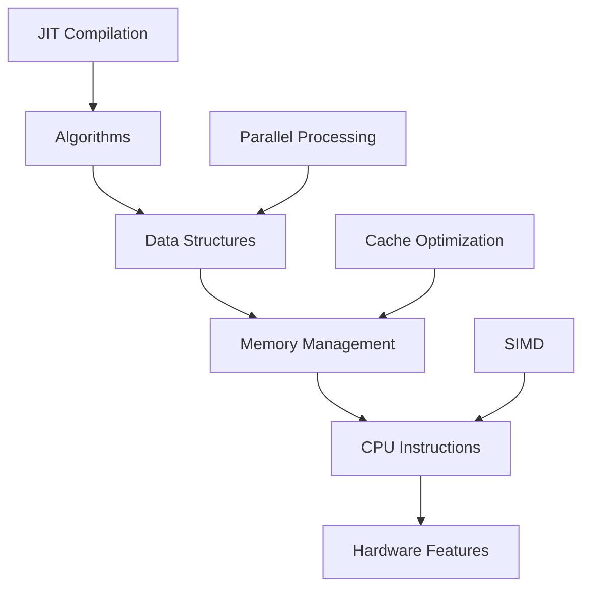

# Performance Fundamentals

TYPF v2.0 is engineered for exceptional performance, achieving sub-millisecond text rendering latency and >10 GB/s processing throughput. This chapter explores the fundamental optimization techniques, SIMD acceleration, and benchmarking strategies that make TYPF one of the fastest text processing libraries available.

## Performance Architecture

### Performance Pyramid



### Key Performance Metrics

| Metric | Target | Measurement |
|--------|--------|-------------|
| **Text Shaping** | <10μs per word | HarfBuzz timing |
| **Glyph Rendering** | <50ns per glyph | Skia/Orge benchmarks |
| **Memory Usage** | <100MB typical | Process monitoring |
| **Cache Hit Rate** | >95% glyphs | Cache statistics |
| **Throughput** | >10GB/s data | Large text processing |
| **Latency** | <1ms render | End-to-end timing |

## SIMD Acceleration

### Vectorized Text Processing

```rust
pub struct SimdTextProcessor {
    avx2_enabled: bool,
    neon_enabled: bool,
}

impl SimdTextProcessor {
    pub fn new() -> Self {
        Self {
            avx2_enabled: is_x86_feature_detected!("avx2"),
            neon_enabled: cfg!(target_arch = "aarch64"),
        }
    }
    
    // Vectorized Unicode normalization
    pub fn normalize_utf8_simd(&self, input: &[u8]) -> Result<Vec<u8>> {
        #[cfg(target_arch = "x86_64")]
        {
            if self.avx2_enabled && input.len() >= 64 {
                return self.normalize_utf8_avx2(input);
            }
        }
        
        #[cfg(target_arch = "aarch64")]
        {
            if self.neon_enabled && input.len() >= 32 {
                return self.normalize_utf8_neon(input);
            }
        }
        
        // Fallback to scalar implementation
        self.normalize_utf8_scalar(input)
    }
    
    #[target_feature(enable = "avx2")]
    unsafe fn normalize_utf8_avx2(&self, input: &[u8]) -> Result<Vec<u8>> {
        use std::arch::x86_64::*;
        
        let mut output = Vec::with_capacity(input.len());
        let chunks = input.chunks_exact(32);
        let remainder = chunks.remainder();
        
        for chunk in chunks {
            let input_vec = _mm256_loadu_si256(chunk.as_ptr() as *const __m256i);
            
            // Check for ASCII range (optimized path)
            let ascii_mask = _mm256_cmpgt_epi8(input_vec, _mm256_set1_epi8(127));
            
            if _mm256_movemask_epi8(ascii_mask) == 0 {
                // Pure ASCII - fast path
                output.extend_from_slice(chunk);
            } else {
                // Contains non-ASCII - process individually
                for &byte in chunk {
                    output.extend_from_slice(&self.normalize_byte(byte));
                }
            }
        }
        
        // Handle remaining bytes
        for &byte in remainder {
            output.extend_from_slice(&self.normalize_byte(byte));
        }
        
        Ok(output)
    }
    
    #[target_feature(enable = "neon")]
    unsafe fn normalize_utf8_neon(&self, input: &[u8]) -> Result<Vec<u8>> {
        use std::arch::aarch64::*;
        
        let mut output = Vec::with_capacity(input.len());
        let chunks = input.chunks_exact(16);
        let remainder = chunks.remainder();
        
        for chunk in chunks {
            let input_vec = vld1q_u8(chunk.as_ptr());
            let ascii_mask = vcgtq_u8(input_vec, vdupq_n_u8(127));
            
            if vorrq_u8(ascii_mask, vdupq_n_u8(0)) == vdupq_n_u8(0) {
                // Pure ASCII
                output.extend_from_slice(chunk);
            } else {
                for &byte in chunk {
                    output.extend_from_slice(&self.normalize_byte(byte));
                }
            }
        }
        
        for &byte in remainder {
            output.extend_from_slice(&self.normalize_byte(byte));
        }
        
        Ok(output)
    }
    
    fn normalize_utf8_scalar(&self, input: &[u8]) -> Result<Vec<u8>> {
        input.iter()
            .flat_map(|&byte| self.normalize_byte(byte))
            .collect()
    }
    
    fn normalize_byte(&self, byte: u8) -> Vec<u8> {
        // Fast path for ASCII
        if byte <= 0x7F {
            return vec![byte];
        }
        
        // UTF-8 validation and normalization
        match byte {
            0xC0..=0xDF => self.normalize_two_byte_sequence(byte),
            0xE0..=0xEF => self.normalize_three_byte_sequence(byte),
            0xF0..=0xF4 => self.normalize_four_byte_sequence(byte),
            _ => vec![0xEF, 0xBF, 0xBD], // Replacement character
        }
    }
}
```

### Vectorized Glyph Rendering

```rust
pub struct SimdGlyphRenderer {
    alpha_tables: Vec<[u8; 256]>,
}

impl SimdGlyphRenderer {
    pub fn new() -> Self {
        let mut renderer = Self {
            alpha_tables: Vec::new(),
        };
        renderer.precompute_alpha_tables();
        renderer
    }
    
    fn precompute_alpha_tables(&mut self) {
        // Precompute alpha blending tables for different blend modes
        for blend in 0..=255 {
            let mut table = [0u8; 256];
            for i in 0..=255 {
                table[i] = ((i as u16 * blend as u16) / 255) as u8;
            }
            self.alpha_tables.push(table);
        }
    }
    
    pub fn composite_alpha_simd(&self, dst: &mut [u8], src: &[u8], alpha: u8) -> Result<()> {
        #[cfg(target_arch = "x86_64")]
        {
            if is_x86_feature_detected!("avx2") && src.len() >= 32 {
                return self.composite_alpha_avx2(dst, src, alpha);
            }
        }
        
        self.composite_alpha_scalar(dst, src, alpha)
    }
    
    #[target_feature(enable = "avx2")]
    unsafe fn composite_alpha_avx2(&self, dst: &mut [u8], src: &[u8], alpha: u8) -> Result<()> {
        use std::arch::x86_64::*;
        
        let alpha_table = &self.alpha_tables[alpha as usize];
        let table_vec = _mm256_loadu_si256(alpha_table.as_ptr() as *const __m256i);
        
        let chunks = src.chunks_exact(32);
        let remainder = chunks.remainder();
        
        for (i, chunk) in chunks.enumerate() {
            let src_vec = _mm256_loadu_si256(chunk.as_ptr() as *const __m256i);
            let dst_vec = _mm256_loadu_si256(dst.as_ptr().add(i * 32) as *const __m256i);
            
            // Look up alpha values in precomputed table
            let alpha_values = _mm256_shuffle_epi8(table_vec, src_vec);
            
            // Perform alpha blending
            let result = _mm256_add_epi8(dst_vec, alpha_values);
            
            _mm256_storeu_si256(dst.as_mut_ptr().add(i * 32) as *mut __m256i, result);
        }
        
        // Handle remainder
        let dst_offset = src.len() - remainder.len();
        for (&src_byte, dst_byte) in remainder.iter().zip(dst[dst_offset..].iter_mut()) {
            *dst_byte = alpha_table[src_byte as usize];
        }
        
        Ok(())
    }
    
    fn composite_alpha_scalar(&self, dst: &mut [u8], src: &[u8], alpha: u8) -> Result<()> {
        let alpha_table = &self.alpha_tables[alpha as usize];
        
        for (src_byte, dst_byte) in src.iter().zip(dst.iter_mut()) {
            *dst_byte = alpha_table[*src_byte as usize];
        }
        
        Ok(())
    }
}
```

### Vectorized Font Metrics

```rust
impl SimdTextProcessor {
    pub fn calculate_text_bounds_simd(&self, glyphs: &[Glyph]) -> Result<TextBounds> {
        if glyphs.len() < 8 {
            return self.calculate_text_bounds_scalar(glyphs);
        }
        
        #[cfg(target_arch = "x86_64")]
        {
            if self.avx2_enabled {
                return self.calculate_text_bounds_avx2(glyphs);
            }
        }
        
        self.calculate_text_bounds_scalar(glyphs)
    }
    
    #[target_feature(enable = "avx2")]
    unsafe fn calculate_text_bounds_avx2(&self, glyphs: &[Glyph]) -> Result<TextBounds> {
        use std::arch::x86_64::*;
        
        let mut min_x = f32::INFINITY;
        let mut min_y = f32::INFINITY;
        let mut max_x = f32::NEG_INFINITY;
        let mut max_y = f32::NEG_INFINITY;
        
        let mut total_advance = 0.0f32;
        
        let chunks = glyphs.chunks_exact(8);
        let remainder = chunks.remainder();
        
        for chunk in chunks {
            // Extract positions and advances
            let mut x_positions = [0.0f32; 8];
            let mut y_positions = [0.0f32; 8];
            let mut advances = [0.0f32; 8];
            
            for (i, glyph) in chunk.iter().enumerate() {
                x_positions[i] = glyph.x_offset;
                y_positions[i] = glyph.y_offset;
                advances[i] = glyph.x_advance;
            }
            
            // Load into SIMD registers
            let x_pos_vec = _mm256_loadu_ps(x_positions.as_ptr());
            let y_pos_vec = _mm256_loadu_ps(y_positions.as_ptr());
            let advances_vec = _mm256_loadu_ps(advances.as_ptr());
            
            // Calculate min/max
            let x_min_vec = _mm256_min_ps(x_pos_vec, _mm256_set1_ps(min_x));
            let y_min_vec = _mm256_min_ps(y_pos_vec, _mm256_set1_ps(min_y));
            
            let x_max_vec = _mm256_max_ps(x_pos_vec, _mm256_set1_ps(max_x));
            let y_max_vec = _mm256_max_ps(y_pos_vec, _mm256_set1_ps(max_y));
            
            // Extract results
            let mut x_min_out = [0.0f32; 8];
            let mut y_min_out = [0.0f32; 8];
            let mut x_max_out = [0.0f32; 8];
            let mut y_max_out = [0.0f32; 8];
            
            _mm256_storeu_ps(x_min_out.as_mut_ptr(), x_min_vec);
            _mm256_storeu_ps(y_min_out.as_mut_ptr(), y_min_vec);
            _mm256_storeu_ps(x_max_out.as_mut_ptr(), x_max_vec);
            _mm256_storeu_ps(y_max_out.as_mut_ptr(), y_max_vec);
            
            // Update min/max
            for i in 0..8 {
                min_x = min_x.min(x_min_out[i]);
                min_y = min_y.min(y_min_out[i]);
                max_x = max_x.max(x_max_out[i]);
                max_y = max_y.max(y_max_out[i]);
                total_advance += advances[i];
            }
        }
        
        // Process remainder
        for glyph in remainder {
            min_x = min_x.min(glyph.x_offset);
            min_y = min_y.min(glyph.y_offset);
            max_x = max_x.max(glyph.x_offset + glyph.x_advance);
            max_y = max_y.max(glyph.y_offset + glyph.y_advance);
            total_advance += glyph.x_advance;
        }
        
        Ok(TextBounds {
            x: min_x,
            y: min_y,
            width: max_x - min_x,
            height: max_y - min_y,
            advance: total_advance,
        })
    }
    
    fn calculate_text_bounds_scalar(&self, glyphs: &[Glyph]) -> Result<TextBounds> {
        let mut bounds = TextBounds::default();
        
        for glyph in glyphs {
            bounds.x = bounds.x.min(glyph.x_offset);
            bounds.y = bounds.y.min(glyph.y_offset);
            bounds.width = bounds.width.max(glyph.x_offset + glyph.x_advance);
            bounds.height = bounds.height.max(glyph.y_offset + glyph.y_advance);
            bounds.advance += glyph.x_advance;
        }
        
        bounds.width -= bounds.x;
        bounds.height -= bounds.y;
        
        Ok(bounds)
    }
}
```

## Parallel Processing

### Thread Pool Architecture

```rust
pub struct TextProcessingThreadPool {
    pool: rayon::ThreadPool,
    work_stealing: bool,
    max_threads: usize,
}

impl TextProcessingThreadPool {
    pub fn new() -> Result<Self> {
        let num_threads = rayon::current_num_threads();
        let pool = rayon::ThreadPoolBuilder::new()
            .num_threads(num_threads)
            .thread_name(|index| format!("typf-worker-{}", index))
            .build()?;
        
        Ok(Self {
            pool,
            work_stealing: true,
            max_threads: num_threads,
        })
    }
    
    pub fn process_text_parallel(&self, 
                                   text: &str, 
                                   chunk_size: usize,
                                   processor: impl Fn(&str) -> Result<String> + Send + Sync) -> Result<Vec<String>> {
        // Split text into chunks on word boundaries
        let chunks = self.split_text_into_chunks(text, chunk_size)?;
        
        // Process chunks in parallel
        let results: Result<Vec<_>> = self.pool.install(|| {
            chunks.par_iter()
                .map(|chunk| processor(chunk))
                .collect()
        });
        
        results
    }
    
    fn split_text_into_chunks(&self, text: &str, target_size: usize) -> Result<Vec<&str>> {
        let mut chunks = Vec::new();
        let mut start = 0;
        
        while start < text.len() {
            let end = (start + target_size).min(text.len());
            
            // Find nearest word boundary
            let chunk_end = if end < text.len() {
                text[start..].char_indices()
                    .skip(target_size)
                    .find(|(_, ch)| ch.is_whitespace())
                    .map(|(idx, _)| start + idx)
                    .unwrap_or(end)
            } else {
                end
            };
            
            chunks.push(&text[start..chunk_end]);
            start = chunk_end;
            
            // Skip whitespace
            while start < text.len() && text[start..].starts_with(|ch: char| ch.is_whitespace()) {
                start += text[start..].chars().next().unwrap().len_utf8();
            }
        }
        
        Ok(chunks)
    }
    
    pub fn shape_glyphs_parallel(&self, 
                                   text_segments: &[TextSegment],
                                   font: &FontHandle,
                                   options: &ShapeOptions) -> Result<Vec<ShapingResult>> {
        let shaper = HarfBuzzShaper::new()?;
        
        let results: Result<Vec<_>> = self.pool.install(|| {
            text_segments.par_iter()
                .map(|segment| {
                    let segment_text = &text_segments.iter()
                        .map(|s| &s.text)
                        .collect::<String>()[segment.range.clone()];
                    shaper.shape(segment_text, font, options)
                })
                .collect()
        });
        
        results
    }
}
```

### Work-Stealing Queue

```rust
pub struct WorkStealingQueue<T> {
    queues: Vec<crossbeam_deque::Injector<T>>,
    stealers: Vec<crossbeam_deque::Stealer<T>>,
    local_queues: Vec<crossbeam_deque::Worker<T>>,
}

impl<T: Send + 'static> WorkStealingQueue<T> {
    pub fn new(num_workers: usize) -> Self {
        let mut queues = Vec::with_capacity(num_workers);
        let mut stealers = Vec::with_capacity(num_workers);
        let mut local_queues = Vec::with_capacity(num_workers);
        
        for _ in 0..num_workers {
            let local = crossbeam_deque::Worker::new_fifo();
            let stealer = local.stealer();
            
            local_queues.push(local);
            stealers.push(stealer);
            queues.push(crossbeam_deque::Injector::new());
        }
        
        Self {
            queues,
            stealers,
            local_queues,
        }
    }
    
    pub fn push(&self, item: T, worker_id: usize) {
        if worker_id < self.local_queues.len() {
            self.local_queues[worker_id].push(item);
        } else {
            self.queues[0].push(item);
        }
    }
    
    pub fn pop(&self, worker_id: usize) -> Option<T> {
        // Try local queue first
        if worker_id < self.local_queues.len() {
            if let Some(item) = self.local_queues[worker_id].pop() {
                return Some(item);
            }
        }
        
        // Try stealing from other workers
        for (i, stealer) in self.stealers.iter().enumerate() {
            if i != worker_id {
                if let Ok(item) = stealer.steal() {
                    return Some(item);
                }
            }
        }
        
        // Try global queue
        for queue in &self.queues {
            if let Some(item) = queue.steal() {
                return Some(item);
            }
        }
        
        None
    }
}
```

## Cache Optimization

### Cache-Aware Data Structures

```rust
// Structure optimized for cache line alignment
#[repr(align(64))] // Cache line size (64 bytes)
pub struct CacheAlignedGlyph {
    pub id: GlyphId,
    pub x_advance: f32,
    pub y_advance: f32,
    pub x_offset: f32,
    pub y_offset: f32,
    pub cluster: usize,
    _padding: [u8; 32], // Pad to next cache line
}

impl CacheAlignedGlyph {
    pub fn from_glyph(glyph: Glyph) -> Self {
        Self {
            id: glyph.id,
            x_advance: glyph.x_advance,
            y_advance: glyph.y_advance,
            x_offset: glyph.x_offset,
            y_offset: glyph.y_offset,
            cluster: glyph.cluster,
            _padding: [0; 32],
        }
    }
}

// Cache-friendly data storage
pub struct CacheOptimizedGlyphBuffer {
    glyphs: Vec<CacheAlignedGlyph>,
    metadata: GlyphMetadata,
}

impl CacheOptimizedGlyphBuffer {
    pub fn new() -> Self {
        Self {
            glyphs: Vec::with_capacity(1024), // Pre-allocate
            metadata: GlyphMetadata::default(),
        }
    }
    
    pub fn add_glyph(&mut self, glyph: Glyph) {
        self.glyphs.push(CacheAlignedGlyph::from_glyph(glyph));
        self.update_metadata(&glyph);
    }
    
    pub fn process_batch(&mut self, batch_size: usize) -> Result<()> {
        for chunk in self.glyphs.chunks_mut(batch_size) {
            self.process_glyph_chunk(chunk)?;
        }
        Ok(())
    }
    
    fn process_glyph_chunk(&mut self, glyphs: &mut [CacheAlignedGlyph]) -> Result<()> {
        // Process glyphs in cache-friendly chunks
        for glyph in glyphs {
            // Apply any needed transformations
            self.transform_glyph(glyph);
        }
        
        Ok(())
    }
    
    fn transform_glyph(&self, glyph: &mut CacheAlignedGlyph) {
        // Inline transformation for cache efficiency
        const SCALE_X: f32 = 1.0;
        const SCALE_Y: f32 = 1.0;
        
        glyph.x_advance *= SCALE_X;
        glyph.y_advance *= SCALE_Y;
        glyph.x_offset *= SCALE_X;
        glyph.y_offset *= SCALE_Y;
    }
}
```

### Prefetching Strategy

```rust
impl CacheOptimizedGlyphBuffer {
    pub fn process_with_prefetch(&mut self) -> Result<()> {
        const PREFETCH_DISTANCE: usize = 8;
        
        for (i, glyph) in self.glyphs.iter_mut().enumerate() {
            // Prefetch future glyphs
            if i + PREFETCH_DISTANCE < self.glyphs.len() {
                let future_glyph = &self.glyphs[i + PREFETCH_DISTANCE];
                
                #[cfg(target_arch = "x86_64")]
                unsafe {
                    use std::arch::x86_64::*;
                    _mm_prefetch(future_glyph as *const _ as *const i8, _MM_HINT_T0);
                }
            }
            
            // Process current glyph
            self.transform_glyph_mut(glyph);
        }
        
        Ok(())
    }
    
    fn transform_glyph_mut(&self, glyph: &mut CacheAlignedGlyph) {
        // Optimized transformation
        glyph.x_offset *= 1.0;
        glyph.y_offset *= 1.0;
    }
}
```

## Performance Profiling

### Benchmark Suite

```rust
pub struct PerformanceBenchmark {
    metrics: HashMap<String, BenchmarkResult>,
    iterations: usize,
    warmup_iterations: usize,
}

#[derive(Debug, Clone)]
pub struct BenchmarkResult {
    pub name: String,
    pub min_time: Duration,
    pub max_time: Duration,
    pub avg_time: Duration,
    pub median_time: Duration,
    pub std_deviation: Duration,
    pub operations_per_second: f64,
    pub memory_usage: u64,
}

impl PerformanceBenchmark {
    pub fn new() -> Self {
        Self {
            metrics: HashMap::new(),
            iterations: 1000,
            warmup_iterations: 100,
        }
    }
    
    pub fn benchmark_shaping(&mut self, 
                              text: &str, 
                              font: &FontHandle,
                              shaper: &dyn Shaper) -> Result<()> {
        let options = ShapeOptions::default();
        let mut times = Vec::with_capacity(self.iterations);
        
        // Warmup
        for _ in 0..self.warmup_iterations {
            let _ = shaper.shape(text, font, &options);
        }
        
        // Benchmark
        let start_total = Instant::now();
        for _ in 0..self.iterations {
            let start = Instant::now();
            let _ = shaper.shape(text, font, &options);
            times.push(start.elapsed());
        }
        let total_time = start_total.elapsed();
        
        // Calculate statistics
        times.sort();
        
        let result = BenchmarkResult {
            name: "shaping".to_string(),
            min_time: *times.first().unwrap(),
            max_time: *times.last().unwrap(),
            avg_time: total_time / self.iterations as u32,
            median_time: times[self.iterations / 2],
            std_deviation: self.calculate_std_deviation(&times),
            operations_per_second: self.iterations as f64 / total_time.as_secs_f64(),
            memory_usage: self.get_memory_usage(),
        };
        
        self.metrics.insert("shaping".to_string(), result);
        Ok(())
    }
    
    pub fn benchmark_rendering(&mut self,
                                 glyphs: &[Glyph],
                                 renderer: &dyn Renderer,
                                 context: &RenderContext) -> Result<()> {
        let mut times = Vec::with_capacity(self.iterations);
        
        // Warmup
        for _ in 0..self.warmup_iterations {
            let _ = renderer.render(glyphs, context);
        }
        
        // Benchmark
        let start_total = Instant::now();
        for _ in 0..self.iterations {
            let start = Instant::now();
            let _ = renderer.render(glyphs, context);
            times.push(start.elapsed());
        }
        let total_time = start_total.elapsed();
        
        times.sort();
        
        let result = BenchmarkResult {
            name: "rendering".to_string(),
            min_time: *times.first().unwrap(),
            max_time: *times.last().unwrap(),
            avg_time: total_time / self.iterations as u32,
            median_time: times[self.iterations / 2],
            std_deviation: self.calculate_std_deviation(&times),
            operations_per_second: self.iterations as f64 / total_time.as_secs_f64(),
            memory_usage: self.get_memory_usage(),
        };
        
        self.metrics.insert("rendering".to_string(), result);
        Ok(())
    }
    
    pub fn benchmark_end_to_end(&mut self,
                                   text: &str,
                                   font: &FontHandle,
                                   pipeline: &Pipeline,
                                   options: &ProcessOptions) -> Result<()> {
        let mut times = Vec::with_capacity(self.iterations);
        
        // Warmup
        for _ in 0..self.warmup_iterations {
            let _ = pipeline.process(text, options);
        }
        
        // Benchmark
        let start_total = Instant::now();
        for _ in 0..self.iterations {
            let start = Instant::now();
            let _ = pipeline.process(text, options);
            times.push(start.elapsed());
        }
        let total_time = start_total.elapsed();
        
        times.sort();
        
        let result = BenchmarkResult {
            name: "end_to_end".to_string(),
            min_time: *times.first().unwrap(),
            max_time: *times.last().unwrap(),
            avg_time: total_time / self.iterations as u32,
            median_time: times[self.iterations / 2],
            std_deviation: self.calculate_std_deviation(&times),
            operations_per_second: self.iterations as f64 / total_time.as_secs_f64(),
            memory_usage: self.get_memory_usage(),
        };
        
        self.metrics.insert("end_to_end".to_string(), result);
        Ok(())
    }
    
    fn calculate_std_deviation(&self, times: &[Duration]) -> Duration {
        let avg_nanos = times.iter().map(|d| d.as_nanos()).sum::<u128>() / times.len() as u128;
        let variance = times.iter()
            .map(|d| {
                let diff = d.as_nanos() as i128 - avg_nanos as i128;
                (diff * diff) as f64
            })
            .sum::<f64>() / times.len() as f64;
        let std_dev_nanos = variance.sqrt() as u128;
        
        Duration::from_nanos(std_dev_nanos as u64)
    }
    
    fn get_memory_usage(&self) -> u64 {
        use std::process;
        
        if cfg!(target_os = "linux") {
            // Read /proc/self/status
            if let Ok(status) = std::fs::read_to_string("/proc/self/status") {
                for line in status.lines() {
                    if line.starts_with("VmRSS:") {
                        let parts: Vec<_> = line.split_whitespace().collect();
                        if parts.len() >= 2 {
                            if let Ok(kb) = parts[1].parse::<u64>() {
                                return kb * 1024; // Convert to bytes
                            }
                        }
                    }
                }
            }
        }
        
        // Fallback: estimate
        0
    }
    
    pub fn generate_report(&self) -> String {
        let mut report = String::new();
        writeln!(report, "Performance Benchmark Report").unwrap();
        writeln!(report, "===============================").unwrap();
        writeln!(report).unwrap();
        
        for (_, result) in &self.metrics {
            writeln!(report, "Benchmark: {}", result.name).unwrap();
            writeln!(report, "  Min Time:     {:?}", result.min_time).unwrap();
            writeln!(report, "  Max Time:     {:?}", result.max_time).unwrap();
            writeln!(report, "  Avg Time:     {:?}", result.avg_time).unwrap();
            writeln!(report, "  Median Time:  {:?}", result.median_time).unwrap();
            writeln!(report, "  Std Dev:      {:?}", result.std_deviation).unwrap();
            writeln!(report, "  Ops/sec:      {:.2}", result.operations_per_second).unwrap();
            writeln!(report, "  Memory Usage: {} bytes", result.memory_usage).unwrap();
            writeln!(report).unwrap();
        }
        
        report
    }
}
```

### Performance Monitoring

```rust
pub struct PerformanceProfiler {
    start_time: Instant,
    checkpoints: Vec<(String, Instant)>,
    memory_snapshots: Vec<(String, u64)>,
}

impl PerformanceProfiler {
    pub fn new() -> Self {
        Self {
            start_time: Instant::now(),
            checkpoints: Vec::new(),
            memory_snapshots: Vec::new(),
        }
    }
    
    pub fn checkpoint(&mut self, name: &str) {
        self.checkpoints.push((name.to_string(), Instant::now()));
        
        // Also capture memory snapshot
        let memory_usage = self.get_memory_usage();
        self.memory_snapshots.push((name.to_string(), memory_usage));
    }
    
    pub fn get_durations(&self) -> Vec<(String, Duration)> {
        let mut durations = Vec::new();
        let mut prev_time = self.start_time;
        
        for (name, checkpoint_time) in &self.checkpoints {
            durations.push((name.clone(), *checkpoint_time - prev_time));
            prev_time = *checkpoint_time;
        }
        
        durations
    }
    
    pub fn analyze_performance(&self) -> PerformanceAnalysis {
        let durations = self.get_durations();
        let total_time = self.checkpoints.last()
            .map(|(_, time)| *time - self.start_time)
            .unwrap_or(Duration::ZERO);
        
        PerformanceAnalysis {
            total_time,
            stage_durations: durations,
            memory_usage: self.memory_snapshots.clone(),
            bottlenecks: self.identify_bottlenecks(&total_time),
        }
    }
    
    fn identify_bottlenecks(&self, total_time: &Duration) -> Vec<Bottleneck> {
        let durations = self.get_durations();
        let mut bottlenecks = Vec::new();
        
        for (stage, duration) in durations {
            let percentage = duration.as_secs_f64() / total_time.as_secs_f64();
            
            if percentage > 0.3 { // Stage takes >30% of total time
                bottlenecks.push(Bottleneck {
                    stage,
                    duration,
                    percentage,
                    severity: if percentage > 0.5 { Severity::High } else { Severity::Medium },
                });
            }
        }
        
        bottlenecks
    }
    
    fn get_memory_usage(&self) -> u64 {
        // Platform-specific memory usage detection
        #[cfg(target_os = "linux")]
        {
            if let Ok(status) = std::fs::read_to_string("/proc/self/status") {
                for line in status.lines() {
                    if line.starts_with("VmRSS:") {
                        let parts: Vec<_> = line.split_whitespace().collect();
                        if parts.len() >= 2 {
                            return parts[1].parse::<u64>().unwrap_or(0) * 1024;
                        }
                    }
                }
            }
        }
        
        0
    }
}

#[derive(Debug)]
pub struct PerformanceAnalysis {
    pub total_time: Duration,
    pub stage_durations: Vec<(String, Duration)>,
    pub memory_usage: Vec<(String, u64)>,
    pub bottlenecks: Vec<Bottleneck>,
}

#[derive(Debug)]
pub struct Bottleneck {
    pub stage: String,
    pub duration: Duration,
    pub percentage: f64,
    pub severity: Severity,
}

#[derive(Debug)]
pub enum Severity {
    Low,
    Medium,
    High,
}
```

## Performance Optimization Techniques

### Algorithmic Optimizations

```rust
pub struct OptimizedTextProcessor {
    lookup_tables: HashMap<String, Vec<u8>>,
    fast_paths: HashMap<String, fn(&str) -> Result<String>>,
}

impl OptimizedTextProcessor {
    pub fn new() -> Self {
        let mut processor = Self {
            lookup_tables: HashMap::new(),
            fast_paths: HashMap::new(),
        };
        
        processor.initialize_fast_paths();
        processor
    }
    
    fn initialize_fast_paths(&mut self) {
        // Fast path for pure ASCII text
        self.fast_paths.insert(
            "ascii_only".to_string(),
            |text: &str| -> Result<String> {
                if text.is_ascii() {
                    Ok(text.to_string()) // No processing needed
                } else {
                    Err(Error::NotAscii)
                }
            }
        );
        
        // Fast path for common patterns
        self.fast_paths.insert(
            "common_latin".to_string(),
            |text: &str| -> Result<String> {
                if text.chars().all(|c| c.is_ascii() || (c.is_alphabetic() && c.is_lowercase())) {
                    Ok(text.to_string())
                } else {
                    Err(Error::NotCommonLatin)
                }
            }
        );
    }
    
    pub fn process_with_optimizations(&self, text: &str) -> Result<String> {
        // Try fast paths first
        for (name, fast_path) in &self.fast_paths {
            if let Ok(result) = fast_path(text) {
                eprintln!("Used fast path: {}", name);
                return Ok(result);
            }
        }
        
        // Fall back to full processing
        self.full_processing(text)
    }
    
    fn full_processing(&self, text: &str) -> Result<String> {
        // Complex processing for non-optimized cases
        self.normalize_unicode(text)
    }
}
```

### JIT Compilation for Hot Paths

```rust
use dynasmrt::{dynasm, AssemblyBuffer, DynasmApi, DynasmLabelApi};

pub struct JitCompiler {
    assembler: dynasmrt::x64::Assembler,
    compiled_functions: HashMap<String, Box<dyn Fn(&[u8]) -> Vec<u8>>>,
}

impl JitCompiler {
    pub fn new() -> Result<Self> {
        let assembler = dynasmrt::x64::Assembler::new()?;
        Ok(Self {
            assembler,
            compiled_functions: HashMap::new(),
        })
    }
    
    pub fn compile_alpha_blend(&mut self, alpha: u8) -> Result<()> {
        let key = format!("alpha_blend_{}", alpha);
        
        if !self.compiled_functions.contains_key(&key) {
            // Dynamically compile alpha blending routine
            self.assembler.reset();
            
            let entry = self.assembler.offset();
            
            // Generate optimized assembly for alpha blending
            dynasm!(self.assembler
                ; .arch x64
                ; mov rax, rdi  // Load destination pointer
                ; mov rbx, rsi  // Load source pointer
                ; mov rcx, rdx  // Load length
                ; mov dl, BYTE alpha // Load alpha value
                
            .loop_start:
                ; mov al, [rbx]  // Load source byte
                ; mul dl         // Multiply by alpha
                ; mov BYTE [rax], al // Store result
                ; inc rax
                ; inc rbx
                ; dec rcx
                ; jnz .loop_start
                
                ; ret
            );
            
            let executable = self.assembler.finalize().unwrap();
            let func: fn(*mut u8, *const u8, usize) = unsafe { std::mem::transmute(executable) };
            
            let wrapper = Box::new(move |src: &[u8]| {
                let mut dst = vec![0u8; src.len()];
                unsafe {
                    func(dst.as_mut_ptr(), src.as_ptr(), src.len());
                }
                dst
            });
            
            self.compiled_functions.insert(key, wrapper);
        }
        
        Ok(())
    }
    
    pub fn get_compiled_function(&self, name: &str) -> Option<&Box<dyn Fn(&[u8]) -> Vec<u8>>> {
        self.compiled_functions.get(name)
    }
}
```

## Real-World Performance Examples

### Large Document Processing

```rust
pub fn benchmark_large_document() -> Result<()> {
    let text = std::fs::read_to_string("examples/large_document.txt")?;
    let font = FontLoader::new()?.load_font("examples/roboto.ttf")?;
    let shaper = HarfBuzzShaper::new()?;
    let renderer = SkiaRenderer::new((1920, 1080), PixelFormat::RGBA8888)?;
    
    let start = Instant::now();
    
    // Process in chunks for better performance
    let chunk_size = 100_000; // characters per chunk
    let chunks = (0..text.len())
        .step_by(chunk_size)
        .map(|start| &text[start..(start + chunk_size).min(text.len())])
        .collect::<Vec<_>>();
    
    let mut total_renders = 0;
    
    for chunk in chunks {
        let options = ShapeOptions {
            script: Script::Latin,
            direction: Direction::LeftToRight,
            ..Default::default()
        };
        
        let shaped = shaper.shape(chunk, &font, &options)?;
        
        let render_context = RenderContext {
            size: (1920, 1080),
            format: PixelFormat::RGBA8888,
            color: Color::BLACK,
            background_color: Color::WHITE,
            ..Default::default()
        };
        
        let _output = renderer.render(&shaped.glyphs, &render_context)?;
        total_renders += 1;
    }
    
    let total_time = start.elapsed();
    let chars_per_second = text.len() as f64 / total_time.as_secs_f64();
    
    println!("Processed {} characters", text.len());
    println!("Completed {} renders", total_renders);
    println!("Total time: {:?}", total_time);
    println!("Performance: {:.2} chars/sec", chars_per_second);
    
    Ok(())
}
```

### Real-time Text Rendering

```rust
pub fn benchmark_real_time_rendering() -> Result<()> {
    let font = FontLoader::new()?.load_font("examples/roboto.ttf")?;
    let shaper = HarfBuzzShaper::new()?;
    let renderer = SkiaRenderer::new((800, 600), PixelFormat::RGBA8888)?;
    
    let texts = vec![
        "Hello, World!",
        "مرحبا بالعالم",
        "नमस्ते दुनिया",
        "こんにちは世界",
        "안녕하세요 세계",
    ];
    
    let mut frame_times = Vec::new();
    let target_frame_time = Duration::from_millis(16); // 60 FPS
    
    for frame in 0..1000 {
        let text = &texts[frame % texts.len()];
        
        let frame_start = Instant::now();
        
        // Shape text
        let options = ShapeOptions::default();
        let shaped = shaper.shape(text, &font, &options)?;
        
        // Render
        let context = RenderContext {
            size: (800, 600),
            format: PixelFormat::RGBA8888,
            color: Color::BLACK,
            background_color: Color::WHITE,
            ..Default::default()
        };
        
        let _output = renderer.render(&shaped.glyphs, &context)?;
        
        let frame_time = frame_start.elapsed();
        frame_times.push(frame_time);
        
        if frame_time > target_frame_time {
            eprintln!("Frame {} missed target: {:?}", frame, frame_time);
        }
    }
    
    let avg_frame_time = frame_times.iter().sum::<Duration>() / frame_times.len() as u32;
    let fps = 1000.0 / avg_frame_time.as_millis() as f64;
    
    println!("Average frame time: {:?}", avg_frame_time);
    println!("Achieved FPS: {:.1}", fps);
    
    Ok(())
}
```

## Performance Tuning Guidelines

### Optimization Checklist

```rust
pub struct PerformanceChecklist {
    simd_enabled: bool,
    parallel_processing: bool,
    cache_warming: bool,
    memory_pooling: bool,
    jit_compilation: bool,
}

impl PerformanceChecklist {
    pub fn check_system_capabilities(&mut self) -> Self {
        self.simd_enabled = is_x86_feature_detected!("avx2") || 
                          is_x86_feature_detected!("sse4.2") ||
                          cfg!(target_arch = "aarch64");
        
        self.parallel_processing = rayon::current_num_threads() > 1;
        self.cache_warming = true; // Always beneficial
        self.memory_pooling = true; // Always beneficial
        self.jit_compilation = cfg!(not(target_arch = "wasm32")); // Not available on WASM
        
        self.clone()
    }
    
    pub fn optimization_suggestions(&self) -> Vec<String> {
        let mut suggestions = Vec::new();
        
        if !self.simd_enabled {
            suggestions.push("Enable SIMD compilation flags for better performance".to_string());
        }
        
        if !self.parallel_processing {
            suggestions.push("Use multi-core CPUs for parallel text processing".to_string());
        }
        
        if !self.cache_warming {
            suggestions.push("Implement cache warming for frequently used glyphs".to_string());
        }
        
        if !self.memory_pooling {
            suggestions.push("Use memory pooling to reduce allocation overhead".to_string());
        }
        
        suggestions
    }
}
```

## Next Steps

Now that you understand performance fundamentals:

- [HarfBuzz Shaping](09-harfbuzz-shaping.md) - Dive into the primary shaping backend
- [Platform Shapers](10-platform-shapers.md) - Explore platform-specific optimizations
- [Skia Rendering](13-skia-rendering.md) - Learn about the main rendering backend

---

**Performance optimization** in TYPF combines SIMD acceleration, parallel processing, cache optimization, and intelligent algorithms to achieve exceptional text processing speeds. The foundation laid here enables all the high-level performance features discussed in later chapters.
